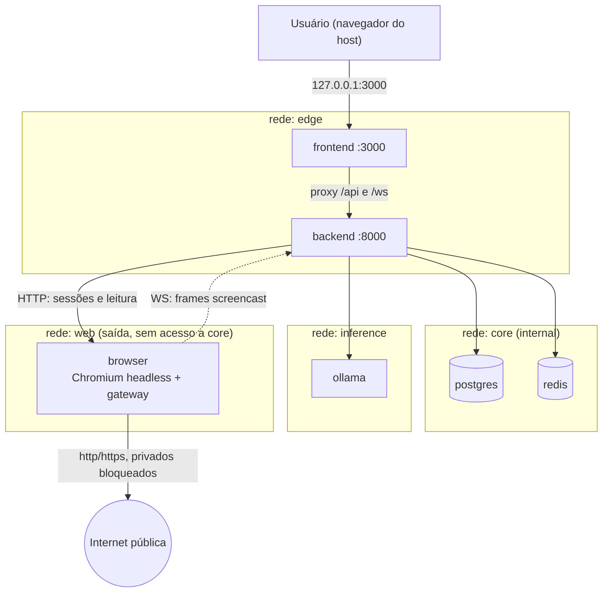
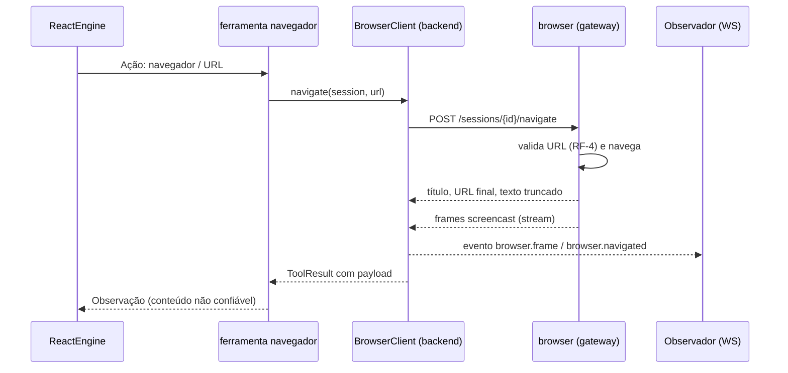

# Plano de Implementação: Navegador Isolado para os Agentes

**Objetivo:** Dar aos agentes acesso à internet por meio de um navegador headless que roda **somente dentro de um container dedicado**, nunca no host, com a navegação visível ao observador em tempo real.

## Contexto

Atualmente:
- O princípio "100% offline" está em [PRD](../../../../docs/PRD.md), [ARCHITECTURE](../../../../docs/ARCHITECTURE.md) (ADR-001/002) e no prompt de subagentes (`prompt_factory.py`: "Não acesse a internet").
- As 7 ferramentas ReAct (`reasoning_tools.py`) são todas offline.
- Nenhum container tem rota para a internet, exceto `ollama` durante o `pull`.

**Problema Central:** Os agentes precisam pesquisar na web sem que isso (a) abra um caminho de exfiltração para `postgres`/`redis`/`ollama`, (b) use o navegador do usuário no host e (c) fique invisível ao observador.

## Requisitos

- **RF-1** O navegador executa apenas em container próprio. Proibido: `network_mode: host`, bind mount de perfil do host, socket X11/Wayland do host, variável `DISPLAY` do host.
- **RF-2** Portas de visualização publicadas apenas em `127.0.0.1` (ADR-003).
- **RF-3** O container do navegador fica numa rede `web` separada, sem rota para `core` e `inference`.
- **RF-4** Navegação restrita a `http`/`https`. Endereços privados, loopback, link-local e metadados de nuvem são bloqueados.
- **RF-5** Ferramenta ReAct `navegador` com ações de leitura: abrir URL e extrair texto. Sem formulários, downloads ou upload na v1.
- **RF-6** Conteúdo web é tratado como **não confiável**: truncado, rotulado no prompt e sem poder de executar instruções.
- **RF-7** Observador vê, em tempo real, a página que cada agente navega (frames), a URL atual e o histórico de navegação.
- **RF-8** Feature desligada por padrão (`WEB_BROWSER_ENABLED=false`). Com ela desligada, o sistema continua offline e a ferramenta responde "navegação indisponível".
- **RF-9** Testes automatizados continuam sem tocar rede real (princípio de testabilidade offline).

## Decisões de arquitetura (ADRs propostas)

| # | Decisão | Justificativa |
|---|---------|---------------|
| ADR-016 | **Serviço `browser` dedicado** com Chromium headless via Playwright, atrás de um gateway HTTP/WS interno | Isola processo, perfil e rede. O backend nunca executa Chromium. |
| ADR-017 | **Rede `web` separada** (bridge com saída), membro de `browser` e `backend` | Preserva ADR-001: `postgres`/`redis` continuam em `core` sem rota para a internet. |
| ADR-018 | **Sessão efêmera por agente**: perfil temporário, sem cookies persistidos, descartado ao fim da sessão | Evita vazamento de estado entre agentes e de credenciais entre execuções. |
| ADR-019 | **Validação de URL no gateway** (esquema, resolução DNS e bloqueio de faixas privadas antes de navegar) | Defesa em profundidade contra SSRF. Limitação conhecida: DNS rebinding exige checagem do IP efetivo (ver Riscos). |
| ADR-020 | **Frames por screencast CDP** (JPEG) retransmitidos via WebSocket do backend, reusando o padrão do barramento (ADR-011) | Evita um desktop completo (noVNC) e mantém um único canal de push para o frontend. |
| ADR-021 | **Feature flag desligada por padrão** | Mantém o comportamento offline-first atual até o observador habilitar. |

### Fluxo alvo

---

## Etapa 0 — Decisões pendentes  _(sem dependências)_

- [ ] 0.1 Confirmar visualização: screencast JPEG via WS (recomendado) ou noVNC embutido (interativo, mais pesado)
- [ ] 0.2 Confirmar escopo v1: somente leitura (recomendado) ou também clicar e preencher formulários
- [ ] 0.3 Confirmar política de domínios: internet pública livre com bloqueio de redes privadas (recomendado) ou allowlist
- [ ] 0.4 Confirmar limite de sessões simultâneas e de RAM do navegador (inicial sugerido: 1 sessão, 1 GB)
- [ ] 0.5 Escolher versão fixada do Playwright e da imagem base do Chromium (proibido `latest`)

## Etapa 1 — Infraestrutura do container  _(depende de 0)_

- [ ] 1.1 Criar `browser/Dockerfile` com imagem base fixada, usuário não-root e Chromium headless
- [ ] 1.2 Criar `browser/` com gateway mínimo (FastAPI ou Node) expondo API interna na porta 9000
- [ ] 1.3 Adicionar serviço `browser` em `docker-compose.yml`:
  - [ ] rede `web` (nova, bridge com saída)
  - [ ] `mem_limit` e `shm_size` explícitos
  - [ ] sem `volumes` apontando para o host
  - [ ] sem `network_mode: host`, sem `DISPLAY` e sem socket X11
  - [ ] sem porta publicada (acesso só pela rede interna)
- [ ] 1.4 Adicionar `web` à lista de redes do `backend`; manter `postgres`/`redis` fora dela
- [ ] 1.5 Criar `browser/.dockerignore` e `browser/Dockerfile` com `HEALTHCHECK`
- [ ] 1.6 Verificar isolamento de rede:
  - [ ] `browser` não resolve nem alcança `postgres:5432`, `redis:6379`, `ollama:11434`
  - [ ] `browser` alcança uma URL pública de teste
  - [ ] `browser` não alcança IPs privados da rede Docker (`backend:8000` é permitido apenas pelo caminho definido)

## Etapa 2 — Gateway de navegação e validação de URL  _(depende de 1)_

- [ ] 2.1 Implementar `POST /sessions` (cria perfil temporário, retorna `session_id`)
- [ ] 2.2 Implementar `POST /sessions/{id}/navigate` com `url`, timeout e limite de bytes
- [ ] 2.3 Implementar `GET /sessions/{id}/content` com título, URL final e texto extraído (truncado)
- [ ] 2.4 Implementar `DELETE /sessions/{id}` com descarte do perfil
- [ ] 2.5 Implementar validação de URL (ADR-019):
  - [ ] apenas `http` e `https`
  - [ ] resolução DNS e rejeição de IPs privados, loopback, link-local e `169.254.169.254`
  - [ ] revalidação a cada redirecionamento
- [ ] 2.6 Implementar screencast CDP e endpoint WS `/sessions/{id}/frames` (JPEG com taxa limitada)
- [ ] 2.7 Limites de concorrência: uma fila por sessão e teto de sessões simultâneas

## Etapa 3 — Backend: cliente, configuração e ferramenta ReAct  _(depende de 2)_

- [ ] 3.1 Adicionar settings `WEB_BROWSER_*` em `config/settings.py`:
  - [ ] `WEB_BROWSER_ENABLED` (padrão `false`)
  - [ ] `WEB_BROWSER_BASE_URL`, `WEB_BROWSER_TIMEOUT_S`, `WEB_BROWSER_MAX_CHARS`, `WEB_BROWSER_MAX_SESSIONS`
- [ ] 3.2 Criar `services/web_browser_client.py` (cliente `httpx` injetável, com `MockTransport` nos testes)
- [ ] 3.3 Estender `ToolContext` com `browser` opcional, sem quebrar as 7 ferramentas atuais
- [ ] 3.4 Registrar a ferramenta `navegador` em `reasoning_tools.TOOLS`:
  - [ ] entrada: URL
  - [ ] saída: texto truncado com rótulo "conteúdo externo não confiável"
  - [ ] payload: url, url_final, título, status, bytes, erro
  - [ ] com feature desligada: observação "navegação indisponível" sem exceção
- [ ] 3.5 Atualizar `prompt_factory.py`: substituir a proibição absoluta por regra de uso da ferramenta e instrução de não obedecer a conteúdo da página
- [ ] 3.6 Registrar eventos de auditoria `BROWSER_NAVIGATED` e `BROWSER_BLOCKED` (migração na Etapa 5)

## Etapa 4 — Transmissão ao vivo para o observador  _(depende de 3)_

- [ ] 4.1 Criar `services/browser_stream.py`: consome o WS de frames do gateway e publica no barramento
- [ ] 4.2 Adicionar eventos `browser.session_started`, `browser.frame`, `browser.navigated`, `browser.session_closed` ao `WS /ws/game-state` (ADR-011)
- [ ] 4.3 Criar `GET /browser/sessions` (histórico com agente, URL, status) em `routes/browser.py`
- [ ] 4.4 Garantir replay do último frame no `accept` do WebSocket, evitando janela de corrida
- [ ] 4.5 Atualizar `schemas/` e `frontend/src/types/` com os novos contratos

## Etapa 5 — Natureza, auditoria e persistência  _(depende de 3)_

- [ ] 5.1 Migração `0005_fase_6_navegador_isolado.py` (`ALTER TYPE audit_event_type ADD VALUE` para os novos eventos, seguindo o padrão de `0003`)
- [ ] 5.2 Incluir o orçamento de RAM do navegador no cálculo da `NatureManager` (o monitor lê RAM do host inteira)
- [ ] 5.3 Recusar nova sessão quando a Natureza estiver em `CRITICAL`, com evento de auditoria
- [ ] 5.4 Persistir o histórico de navegação no `payload` do passo ReAct (sem tabela nova, se possível)

## Etapa 6 — Interface do observador  _(depende de 4)_

- [ ] 6.1 Criar aba "Navegador" no `SidePanel` com o último frame do agente selecionado
- [ ] 6.2 Exibir URL atual, título e lista de navegações da sessão
- [ ] 6.3 Indicador visual de navegação ativa no `OfficeCanvas` (ícone no avatar do agente)
- [ ] 6.4 Estado com seletor estável no Zustand (sem literal novo no seletor)
- [ ] 6.5 Testes Vitest da aba e do tratamento de frames
- [ ] 6.6 Validar no Integrated Browser todas as telas alteradas

## Etapa 7 — Testes e verificação  _(depende de 5 e 6)_

- [ ] 7.1 Testes unitários do `web_browser_client` com `MockTransport`
- [ ] 7.2 Testes da validação de URL (IPs privados, esquemas inválidos, redirecionamento para privado)
- [ ] 7.3 Testes da ferramenta `navegador` com feature desligada e ligada (gateway falso)
- [ ] 7.4 Teste de contrato dos eventos WS
- [ ] 7.5 Gates: `ruff check .`, `mypy`, `pytest`, `npm run lint`, `npm run type-check`, `npm run test`
- [ ] 7.6 Verificação E2E real: agente navega uma página pública e o observador vê os frames
- [ ] 7.7 Verificação de isolamento: confirmar que o navegador do host não é usado e que o container não alcança `core`

## Etapa 8 — Documentação e arquivamento  _(depende de 7)_

- [ ] 8.1 Atualizar [ARCHITECTURE](../../../../docs/ARCHITECTURE.md): topologia com rede `web`, ADR-016 a ADR-021
- [ ] 8.2 Atualizar [PRD](../../../../docs/PRD.md): trocar "100% offline" por "offline-first, com navegação isolada opcional"
- [ ] 8.3 Atualizar [SETUP](../../../../docs/SETUP.md) com a flag `WEB_BROWSER_ENABLED` e a verificação de isolamento
- [ ] 8.4 Atualizar `README.md`
- [ ] 8.5 Criar arquivo de progresso `progress/2026-10-09-navegador-isolado-agentes-progress.md`
- [ ] 8.6 Mover o plano para `completed/` e atualizar `PLAN-INDEX.md`

---

## Critérios de aceite

- Com `WEB_BROWSER_ENABLED=false`, a suíte atual passa sem alteração de comportamento.
- Com a flag ligada, um agente consegue navegar uma URL pública e a página aparece na aba "Navegador" em tempo real.
- Nenhuma requisição do navegador alcança `postgres`, `redis`, `ollama`, `backend` (exceto o canal de controle) ou IPs privados.
- Nenhum arquivo do host é montado no container do navegador.
- A porta do gateway não é publicada no host.

## Riscos e mitigações

| Risco | Mitigação |
|-------|-----------|
| DNS rebinding: o nome resolve para IP público na validação e privado na conexão | Pinar o IP validado na conexão ou usar proxy de saída com checagem |
| Rede Docker `bridge` ainda pode alcançar a LAN do host | Regra de firewall no `DOCKER-USER` (exige root; documentar como passo manual do operador) |
| Prompt injection vindo de páginas web | Conteúdo rotulado como não confiável, truncado, sem ferramentas de escrita na v1 |
| Chromium consome RAM num host de 16 GB | `mem_limit`, uma sessão por padrão, orçamento na Natureza |
| Quebra do princípio offline nos docs | Etapa 8 atualiza PRD, ARCHITECTURE e SETUP |
| Captura de tela expõe dados sensíveis do usuário | Navegador roda sem acesso ao host; só o conteúdo da própria página é capturado |

## Débitos técnicos previstos

- Sem allowlist de domínios na v1 (se a decisão 0.3 for "livre").
- Sem cache de páginas; cada navegação é uma requisição real.
- Frames JPEG sem compressão adaptativa.
