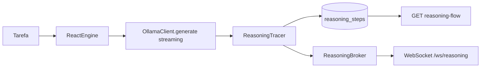
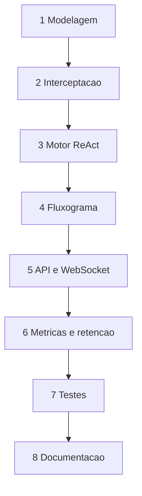

# Plano de Implementação: Fase 3 - Transparência e Observabilidade (Backend)

**Objetivo:** Interceptar e visualizar o fluxo cognitivo (ReAct/Chain-of-Thought) de cada agente em tempo real, transformando pensamentos brutos em estrutura de fluxogramas para o frontend.

**Status:** ✅ Concluído em 2026-10-03

**Bloqueante:** ~~Fase 2~~ — concluída

---

## Decisões de arquitetura (ADRs da Fase 3)

| # | Decisão | Justificativa |
|---|---------|---------------|
| ADR-004 | **Wrapper customizado sobre o Ollama** em vez de LangGraph/CrewAI | As libs arrastam dezenas de dependências transitivas sem pin, assumem rede e escondem o prompt real. O projeto é 100% offline e determinístico; a interceptação é trivial sobre o streaming nativo de `/api/generate`. |
| ADR-005 | **Uma tabela `reasoning_steps` com discriminador** em vez de 4 tabelas (thought/action/observation/conclusion) | As 4 tabelas teriam colunas idênticas. Um enum `ReasoningStepType` + `payload` JSONB preserva a semântica, simplifica o replay ordenado (`sequence`) e evita 4 JOINs para montar o fluxograma. |
| ADR-006 | **Broker pub/sub in-process (asyncio)** em vez de Redis nesta fase | O backend roda num único worker. O broker é isolado atrás de uma interface para ser trocado por Redis na Fase 4 sem tocar nas rotas. |
| ADR-007 | **Captura síncrona na transação do agente** | O passo é persistido e publicado no mesmo ponto; sem fila intermediária não há como perder passo nem reordenar. |

### Fluxo alvo



---

## Etapa 1 — Modelagem e persistência  _(sem dependências)_

- [x] 1.1 Criar enums em `models/enums.py`:
  - [x] `ReasoningStepType` (THOUGHT, ACTION, OBSERVATION, CONCLUSION)
  - [x] `ReasoningStatus` (RUNNING, COMPLETED, FAILED, CANCELLED)
  - [x] Novos `AuditEventType`: REASONING_STARTED, REASONING_COMPLETED, REASONING_FAILED, REASONING_PURGED
- [x] 1.2 Criar `models/reasoning.py`:
  - [x] `ReasoningSession` (`reasoning_sessions`): agent_id, thread_id, task, status, model_name, complexity, contadores de tokens, duração, step_count, started_at/finished_at, error
  - [x] `ReasoningStep` (`reasoning_steps`): session_id, sequence, step_type, content, model_name, tokens, duration_ms, payload JSON
  - [x] Índices de consulta: `(session_id, sequence)`, `(agent_id, started_at)`, `(status)`
- [x] 1.3 Exportar os novos símbolos em `models/__init__.py`
- [x] 1.4 Escrever a migração `0003_fase_3_observabilidade.py` à mão (enums novos + `ALTER TYPE audit_event_type ADD VALUE`)
- [x] 1.5 Adicionar settings `REASONING_*` (teto de passos, retenção, buffer do stream)

## Etapa 2 — Interceptação do fluxo ReAct  _(depende de 1)_

- [x] 2.1 Estender `services/ollama_client.py` com geração em streaming:
  - [x] `generate(...)` sobre `POST /api/generate` com `stream=true`
  - [x] Callback por chunk (`on_token`) para capturar o pensamento bruto token a token
  - [x] `OllamaCompletion` com texto, `prompt_tokens`, `completion_tokens`, `duration_ms`
- [x] 2.2 Criar `services/reasoning_tracer.py`:
  - [x] `ReasoningTracer` com callbacks `on_thought`, `on_action`, `on_observation`, `on_conclusion`
  - [x] Cada callback persiste um `ReasoningStep` e publica no broker
  - [x] Vincula modelo LLM e tokens consumidos a cada passo
  - [x] Encerramento com `complete()` / `fail()` consolidando os totais na sessão
- [x] 2.3 Criar `services/reasoning_broker.py`:
  - [x] Pub/sub in-process com `asyncio.Queue` por assinante
  - [x] Canais por agente + canal global
  - [x] Descarte do evento mais antigo quando a fila do assinante satura (backpressure)
- [x] 2.4 Registrar eventos de auditoria no início e no fim de cada sessão

## Etapa 3 — Motor ReAct e captura de contexto de ferramentas  _(depende de 2)_

- [x] 3.1 Criar `services/react_engine.py`:
  - [x] Prompt ReAct com formato `Pensamento/Ação/Entrada da Ação/Observação/Conclusão`
  - [x] Parser tolerante da resposta do modelo
  - [x] Loop com teto de iterações (`reasoning_max_steps`)
  - [x] Fallback determinístico quando o Ollama está indisponível (offline-first)
- [x] 3.2 Registro de ferramentas offline, com captura integral de entrada e saída:
  - [x] `memoria_corporativa` — busca em `corporate_memory` (termos de pesquisa + resultados)
  - [x] `banco_de_talentos` — consulta perfis (query + perfis retornados)
  - [x] `auditoria` — consulta eventos recentes
  - [x] `infraestrutura` — snapshot da Natureza
  - [x] `calculadora` — expressão aritmética avaliada por AST (sem `eval`)
- [x] 3.3 Persistir no `payload` de cada ação: nome da ferramenta, entrada bruta, resultado e erro
- [x] 3.4 Atualizar o `AgentStatus` do agente durante a execução (WORKING → IDLE/BLOCKED)

## Etapa 4 — Serialização em fluxograma  _(depende de 3)_

- [x] 4.1 Criar `services/reasoning_flow.py`:
  - [x] Nós tipados com rótulo, ícone, cor e `column`/`row` como _layout hints_
  - [x] Arestas sequenciais + aresta de retorno observação → pensamento (ciclo ReAct)
  - [x] Metadados por nó: timestamp, duração, tokens, modelo
  - [x] Formato compatível com D3.js / React Flow (`{nodes, edges, meta}`)
- [x] 4.2 Expor `build_flow(session)` e `build_live_status(agent)`

## Etapa 5 — API HTTP e WebSocket  _(depende de 4)_

- [x] 5.1 Criar `schemas/reasoning.py` com os contratos Pydantic
- [x] 5.2 Criar `routes/reasoning.py`:
  - [x] `POST /agents/{agent_id}/reasoning/run` — executa tarefa com captura
  - [x] `GET /agents/{agent_id}/reasoning-flow` — fluxograma atual/mais recente
  - [x] `GET /agents/{agent_id}/live-status` — status, progresso, última ação, tempo decorrido
  - [x] `GET /reasoning/sessions` — histórico filtrável
  - [x] `GET /reasoning/sessions/{id}` — replay completo
  - [x] `GET /reasoning/sessions/{id}/flow` — fluxograma de uma sessão específica
  - [x] `GET /reasoning/metrics` — dashboard de métricas
  - [x] `POST /reasoning/retention/purge` — política de retenção
  - [x] `GET /reasoning/export` — export para análise
- [x] 5.3 Criar `routes/ws.py`:
  - [x] `WS /ws/agents/{agent_id}/reasoning` — push por agente
  - [x] `WS /ws/reasoning` — push global
  - [x] Replay dos passos já executados no `accept` (evita janela de corrida)
- [x] 5.4 Registrar os routers em `routes/__init__.py`

## Etapa 6 — Métricas e retenção  _(depende de 5)_

- [x] 6.1 `services/reasoning_metrics.py`:
  - [x] Tokens por agente e por modelo
  - [x] Tempo médio de decisão e duração por passo
  - [x] Taxa de sucesso/erro
  - [x] Modelos mais utilizados
  - [x] Custo computacional estimado (RAM×tempo) e ROI por subagente
- [x] 6.2 Retenção: `purge_sessions(before)` com evento de auditoria
- [x] 6.3 Export estruturado (JSON) de sessões para análise externa

## Etapa 7 — Testes  _(depende de 6)_

- [x] 7.1 `tests/test_reasoning_tracer.py` — captura de cada tipo de passo, ordem e totais
- [x] 7.2 `tests/test_react_engine.py` — parser, loop, teto de iterações, ferramentas, fallback
- [x] 7.3 `tests/test_reasoning_flow.py` — nós, arestas, layout hints, serialização JSON
- [x] 7.4 `tests/test_reasoning_metrics.py` — agregações, retenção e export
- [x] 7.5 `tests/test_api_fase3.py` — endpoints HTTP + WebSocket + múltiplos agentes
- [x] 7.6 Teste de overhead da captura (<10% sobre a execução sem tracer)
- [x] 7.7 `ruff check .`, `mypy` e `pytest` limpos

## Etapa 8 — Documentação  _(depende de 7)_

- [x] 8.1 `docs/REASONING-FORMAT.md` — formato ReAct e contrato dos passos
- [x] 8.2 `docs/API-REASONING.md` — endpoints REST e WebSocket
- [x] 8.3 `docs/FLOWCHART-SCHEMA.md` — schema do fluxograma
- [x] 8.4 Atualizar `docs/ARCHITECTURE.md` (§4.8 Observabilidade) e `README.md`
- [x] 8.5 Atualizar `PLAN-INDEX.md` e o arquivo de progresso

---

## Dependências



```
← Fase 2 (Sociedade) [CONCLUÍDA]
Fase 3 (Observabilidade)
└→ Fase 4 (Interface 2D)
```
