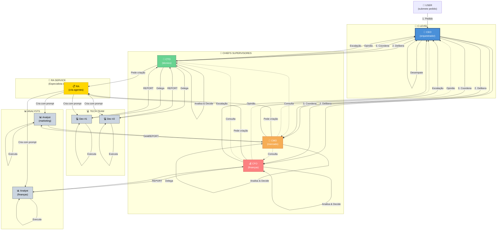

# Plano de Implementação: Fase 5 — Rede Corporativa e Grafo de Comunicações

**Objetivo:** Implementar um **grafo dinâmico de comunicações e decisões** onde usuários submitem pedidos aos chiefs, os chiefs deliberam, delegam, recebem relatórios dos agentes, analisam qualidade do trabalho e decidem o próximo passo (reconvocar agente, consultar colegas, contratar novo recurso, ou aprovar).

## Contexto

Atualmente:
- Ao executar `POST /agents/{agent_id}/reasoning/run`, o chief trabalha sozinho sem conversar com colegas
- Não há UI no frontend para submeter pedidos iniciais aos chiefs
- Não existe feedback loop entre agentes e seus delegadores
- Não há mecanismo de reavaliação de qualidade de trabalho ou redirecionamento de tarefas

**Problema Central:** O workflow corporativo é hierárquico e especializado. Cada agente tem um **chief supervisor competente**:
- **Developer** → reporta para **CTO** (supervisor técnico)
- **Analyst Financeiro** → reporta para **CFO** (supervisor financeiro)
- **Analyst Marketing** → reporta para **CMO** (supervisor de mercado)

**Nota sobre RA:** O **RA (Recursos Agênticos)** não é supervisor direto. RA é:
- Especialista em prompts e criação de agentes
- Recebe pedidos dos chiefs para criar novos agentes
- Cria o agente com seu prompt especializado
- O agente automaticamente passa a reportar para o chief que pediu
- RA não participa da cadeia de reporting/supervisão
- Apenas chiefs podem solicitar ao RA a criação de agentes

Quando um agente completa uma tarefa:
1. **Agente reporta** para seu **chief especializado** (não para CEO)
2. **Chief especializado analisa** com suas 7 ferramentas de avaliação
3. **Chief decide** dinamicamente:
   - ❌ Rejeitar e reconvocar o mesmo agente para corrigir
   - ✏️ Ajustar escopo e redelegar parcialmente
   - ✅ Aprovar se está em sua área de decisão
   - 📞 Consultar colegas chiefs se decisão afeta múltiplas áreas
   - 👥 Escalar para CEO se for estratégico
4. **Decisões complexas** envolvem deliberação entre chiefs com **desempate do CEO**

Isso forma um **grafo de comunicações hierárquico**, não um pipeline linear.

## Visualização: Grafo de Comunicações (Hierárquico)



**Fluxo de Comunicação:**

1. **USER** → submete pedido estratégico ao CEO
2. **CEO Delibera** → consulta todos os chiefs em paralelo
3. **Chiefs Opinam** → cada um contribui com sua especialidade
4. **CEO Coordena** → aloca tarefas aos chiefs responsáveis
5. **Chiefs Solicitam Agentes** → quando precisam de novos recursos
   - CTO pede ao RA: "Cria um Dev especializado em FastAPI"
   - CMO pede ao RA: "Cria um Analyst de marketing"
   - CFO pede ao RA: "Cria um Analyst financeiro"
6. **RA Cria Agentes** → especialista em prompts, cria com contexto
7. **Chiefs Delegam** → cada chief delega para seus agentes especializados
8. **Agentes Executam** → cada um faz seu próprio reasoning
9. **Reports ao Chief** → **agentes reportam para seu supervisor especializado** (não para RA, não para CEO)
10. **Chiefs Analisam** → cada chief avalia com suas 7 ferramentas
11. **Decisões Complexas** → chefes consultam uns aos outros
12. **CEO Desempata** → em caso de disagreement entre chiefs

## Entregas Esperadas

1. **Tabela de Eventos/Mensagens:** Grafo direcionado de comunicações entre agentes
2. **Request com Task Graph:** Cada pedido gera um grafo de tarefas que evolui dinamicamente
3. **Agent Response Handler:** Quando agente completa tarefa, reporta para seu delegador
4. **Chief Decision Engine:** Chief recebe report e executa reasoning para decidir próximo passo
5. **Pub/Sub para Comunicações:** Barramento de eventos para routing dinâmico de mensagens
6. **UI de Rede:** Frontend visualiza o grafo de comunicações em tempo real
7. **Histórico Completo:** Todas as conversas, decisões e mudanças de estado persistem

## Fases de Implementação

### Fase I: Backend — Schema de Grafo de Comunicações

- [x] **I.1** Criar tabela `communication_graph`:
  - `id` (PK)
  - `request_id` (FK → initial_requests)
  - `sender_agent_id` (FK → agents) — quem iniciou ou respondeu
  - `recipient_agent_id` (FK → agents) — alvo da comunicação
  - `communication_type` (enum: DELEGATION, REPORT, CONSULTATION, DECISION)
  - `content` (JSONB) — tarefa, relatório, pergunta, veredito
  - `reasoning_session_id` (FK → reasoning_sessions) — o pensamento que gerou
  - `status` (enum: PENDING, ACKNOWLEDGED, PROCESSED)
  - `created_at`, `responded_at`

- [x] **I.2** Estender `initial_requests`:
  - `status` (PROPOSED → DELIBERATING → IN_EXECUTION → AWAITING_FEEDBACK → COMPLETED/FAILED)
  - `current_state` (JSONB) — snapshots de progresso

- [x] **I.3** Criar tabela `agent_tasks`:
  - `assigned_by_chief_id` (FK → agents, sempre um chief) — **chief que delegou**
  - `assigned_to_agent_id` (FK → agents) — agente subordinado
  - `task_description`, `context` (JSONB)
  - `status`: PENDING → ACKNOWLEDGED → IN_PROGRESS → COMPLETED/REJECTED
  - `report_reasoning_session_id` (FK → reasoning_sessions) — report do agente
  - `review_reasoning_session_id` (FK → reasoning_sessions) — análise do chief
  - Restrição: `assigned_to_agent.reporting_chief_id` == `assigned_by_chief_id` (só chief supervisiona seus agentes)

- [x] **I.4** Estender tabela `agents`:
  - `reporting_chief_id` (FK → agents, NULL para CEO) — **supervisor hierárquico**
  - Exemplo: dev.reporting_chief_id = CTO.id, analyst_finance.reporting_chief_id = CFO.id

### Fase II: Backend — Serviços de Grafo e Comunicação

- [x] **II.1** Serviço `communication_service`:
  - `create_request(topic, description)` → inicia grafo
  - `delegate_task(from_agent, to_agent, task)` → nó DELEGATION
  - `report_task_completion(task_id, reasoning_session)` → nó REPORT
  - `route_communication(message)` → pub/sub com routing inteligente

- [x] **II.2** Serviço `agent_decision_engine`:
  - `analyze_report(task_id, report_session)` → **chief supervisor** usa reasoning para avaliar report do seu agente
  - `decide_next_step(task_id)` → reconvocar, corrigir, consultar colegas, ou aprovar
  - Retorna um dos: REJECT, MODIFY, APPROVE, CONSULT_PEERS, ESCALATE_TO_CEO
  - **Crucial:** Chief usa suas 7 ferramentas especializadas (não genéricas)

- [x] **II.3** Estender `council_service`:
  - `deliberate_and_coordinate(request_id)` — CEO + Chiefs deliberam juntos
  - `chief_review_and_decide(task_id, chief_id)` → chief especializado analisa report
  - `escalate_to_ceo(task_id, reason)` → quando chiefs divergem ou decisão é estratégica
  - `ceo_final_decision(task_id)` → CEO faz desempate entre chiefs

### Fase III: Backend — Endpoints

- [x] **III.1** Requests:
  - `POST /council/request-action` — submeter
  - `GET /council/requests` — listar
  - `GET /council/requests/{request_id}/graph` — retornar estrutura do grafo

- [x] **III.2** Tasks:
  - `GET /agents/{agent_id}/tasks` — tarefas pendentes do agente
  - `POST /agents/{agent_id}/task/{task_id}/report` — **agente reporta ao seu chief supervisor** (automático, não manual)
  - `GET /chiefs/{chief_id}/pending-reviews` — **tarefas de subordinados aguardando review do chief**
  - `GET /chiefs/{chief_id}/supervised-agents` — lista agentes sob supervisão

- [x] **III.3** RA Service (criação de agentes):
  - `POST /ra/create-agent` — **chief solicita criação de novo agente**
    - Inputs: agent_role, specialty, description, requesting_chief_id
    - Outputs: agent_id, created_prompt, reporting_chief_id (mesmo do solicitante)
  - `GET /ra/created-agents` — lista histórico de agentes criados pelo RA

- [x] **III.4** Decisions (executadas pelo chief supervisor):
  - `POST /chiefs/{chief_id}/task/{task_id}/review-and-decide` — **chief especializado** analisa e decide
    - Inputs: task_id, report_session_id
    - Outputs: decision (APPROVE/REJECT/MODIFY/CONSULT_PEERS/ESCALATE), rationale, next_action
  - `POST /chiefs/{chief_id}/consult-peers` — chief consulta colegas sobre decisão complexa
  - `POST /ceo/final-decision/{task_id}` — CEO faz desempate ou decisão estratégica

- [x] **III.4** WebSocket:
  - Estender `/ws/game-state` para transmitir mutações do grafo em tempo real

### Fase IV: Frontend — UI de Rede

- [x] **IV.1** Nova aba "Rede Corporativa":
  - Visualização do grafo (D3.js ou Cytoscape.js)
  - Nós = agentes, Arestas = comunicações
  - Zoom/pan, legendas

- [x] **IV.2** Componente `RequestForm`:
  - Tópico + Descrição
  - Botão "Submeter"

- [x] **IV.3** Painel de Tarefas:
  - Aba "Info" → Tarefas Pendentes/Em Progresso/Concluídas
  - Reports com análise do chief

- [x] **IV.4** Painel de Decisões:
  - Chief analisando (reasoning em tempo real)
  - Resultado final (Aprovado/Rejeitado/Modificado/Consultar)

### Fase V: Integração e Comportamentos

- [x] **V.1** Modo AUTOMÁTICO vs MANUAL

- [x] **V.2** WebSocket Handlers no Frontend:
  - Atualizar grafo em tempo real
  - Sincronizar gameStore

- [x] **V.3** Pub/Sub Backend:
  - Atomicidade de DELEGATION → agent_task → pub/sub
  - Transações Alembic

### Fase VI: Testes

- [x] **VI.1** Unitários (communication_service, agent_decision_engine)
- [x] **VI.2** Integração (fluxo completo: request → deliberar → delegar → report → decidir)
- [x] **VI.3** Frontend (grafo renderiza, WebSocket sincroniza)

### Fase VII: Validação E2E

- [x] **VII.1** Cenário completo no navegador:
  1. Submeter "Fundar startup"
  2. CEO delibera com conselho
  3. Delegações criadas
  4. Agents executam
  5. Reports chegam
  6. Chiefs analisam e decidem
  7. Novo ciclo ou conclusão

- [x] **VII.2** Documentação:
  - `docs/COMMUNICATION-GRAPH.md` (novo)
  - Atualizar `ARCHITECTURE.md`, `CHIEF-LOGIC.md`, `API-REASONING.md`

- [x] **VII.3** Índices e Progress

## Conceitos-Chave

### Grafo de Comunicações (DAG Hierárquico)

Cada request gera uma árvore de comunicações com **supervisão especializada**:

```
[USER REQUEST]
    ↓
[CEO Deliberation] (reasoning_session_1)
    ├─ [CTO Opinion] (reasoning_session_2)
    ├─ [CMO Opinion] (reasoning_session_3)
    ├─ [CFO Opinion] (reasoning_session_4)
    └─ [CEO Coordination] (reasoning_session_5)
        ├─ CTO pede ao RA: "Cria Dev especializado em FastAPI"
        │   └─ RA cria Dev#1 com prompt especializado
        │
        ├─ CTO DELEGATION → Dev#1 (task_101)
        │   ├─ Dev#1 Executes (reasoning_session_6)
        │   └─ Dev#1 REPORTS TO CTO (reasoning_session_7)  ← Ao seu chief supervisor!
        │       ├─ CTO REVIEWS (reasoning_session_8)  ← Chief especializado analisa
        │       └─ CTO Decides:
        │           ├─ REJECT → Dev#1 novamente (reconvocar)
        │           ├─ MODIFY → novo subtask
        │           ├─ APPROVE → completa
        │           └─ CONSULT PEERS → CMO/CFO opinam
        │
        ├─ CMO pede ao RA: "Cria Analyst de Marketing"
        │   └─ RA cria Analyst#2 com prompt especializado
        │
        ├─ CMO DELEGATION → Analyst Marketing (task_102)
        │   ├─ Analyst Executes (reasoning_session_9)
        │   └─ Analyst REPORTS TO CMO (reasoning_session_10)  ← Ao seu chief supervisor!
        │       └─ CMO REVIEWS & Decides (reasoning_session_11)  ← Chief especializado
        │
        └─ CFO pede ao RA: "Cria Analyst Financeiro"
            └─ RA cria Analyst#3 com prompt especializado
            
        └─ CFO DELEGATION → Analyst Finance (task_103)
            ├─ Analyst Executes (reasoning_session_12)
            └─ Analyst REPORTS TO CFO (reasoning_session_13)  ← Ao seu chief supervisor!
                └─ CFO REVIEWS & Decides (reasoning_session_14)  ← Chief especializado
                    └─ Se divergem: escalam para CEO para desempate
```

**Diferenças vs. Linear:**
- ✅ Cada **chief analisa seu próprio time** (especialização)
- ✅ **RA cria agentes sob demanda** (especialista em prompts, não supervisor)
- ✅ Agentes criados pelo RA **reportam automaticamente para o chief que pediu**
- ✅ Decisões são **paralelas** (reports chegam em paralelo, chiefs revisam em paralelo)
- ✅ **Chiefs consultam uns aos outros** quando afeta múltiplas áreas
- ✅ **CEO desempata** apenas em casos de desacordo ou estratégicos
- ✅ **Reconvocações e modificações** ficam no mesmo chief (não pulam hierarquia)

### Fluxo de Feedback (Com Supervisão Especializada)

1. **Chief precisa de novo agente** → solicita ao RA
   - "CTO pede ao RA: Cria Dev especializado em FastAPI"
   - "CMO pede ao RA: Cria Analyst de Marketing"
2. **RA cria agente** → especialista em prompts, cria com contexto especializado
   - Retorna: agent_id, prompt criado
3. **Agente automaticamente passa a reportar para o chief que pediu** → via `agents.reporting_chief_id`
4. **Chief delega tarefa ao seu agente** → DELEGATION node, agent_tasks.status = PENDING
5. **Agent reconhece** → ACKNOWLEDGED
6. **Agent executa** → IN_PROGRESS (seu próprio reasoning)
7. **Agent reporta para seu chief supervisor** → REPORT node + reasoning_session
   - **Crucial:** Dev reporta para CTO (não para RA, não para CEO)
   - **Crucial:** Analyst reporta para CMO/CFO (não para RA, não para CEO)
8. **Chief supervisor recebe report** → PENDING REVIEW
9. **Chief analisa com suas ferramentas especializadas** → reasoning automático
10. **Chief decide** → REJECT | MODIFY | APPROVE | CONSULT_PEERS | ESCALATE
    - Se **REJECT/MODIFY** → DELEGATION novamente para mesmo agente (reconvoca)
    - Se **CONSULT_PEERS** → consulta colegas chiefs (CTO consulta CMO/CFO)
    - Se **APPROVE** → completa task
    - Se **ESCALATE** → vai para CEO quando divergem de colegas
11. **Parallelismo real** → múltiplos chiefs revisam seus agentes ao mesmo tempo

## Dependências

- ✅ Fase 3 (ReAct)
- ✅ Fase 4 (Motor 2D)
- ❌ **NOVA:** Pub/Sub robusto (threading safe)

## Débitos Técnicos

1. Parsing de decisões LLM → usar ferramentas no ReAct
2. Paralelismo → session.expire_all() + broadcasting
3. Atomicidade de transações → Alembic + flushes
4. Timeouts/Retry → escalação automática
5. Visualização de grandes grafos → virtual scrolling

## Estimativa

- Backend: 24–28 horas
- Frontend: 16–20 horas
- Testes: 12–16 horas
- **Total:** 52–64 horas (~6–8 dias concentrados)
