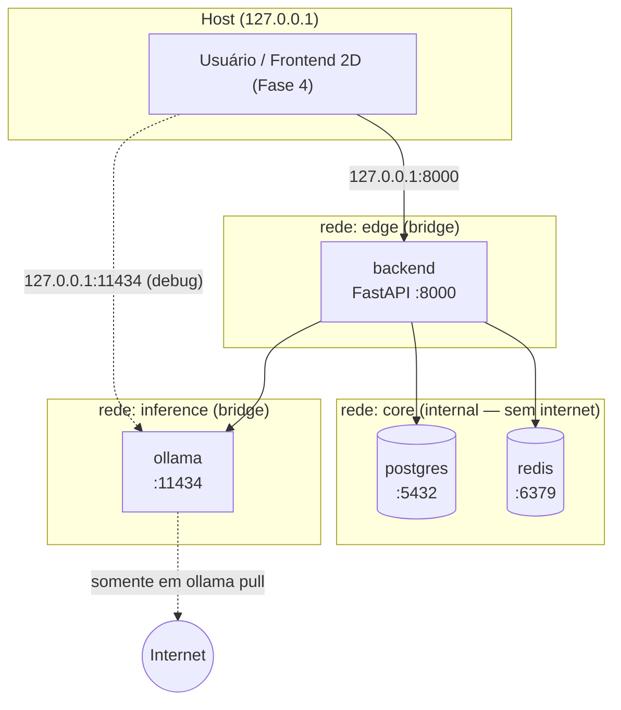
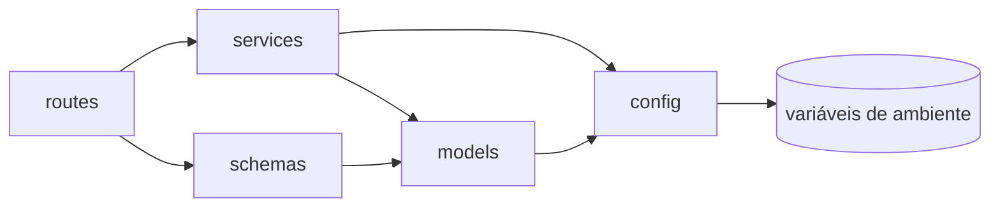
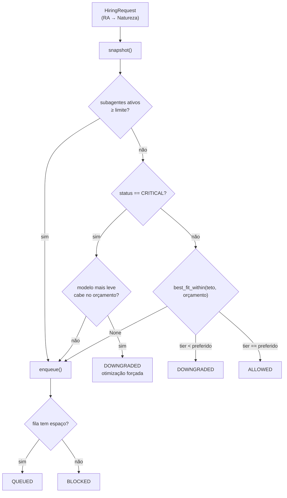
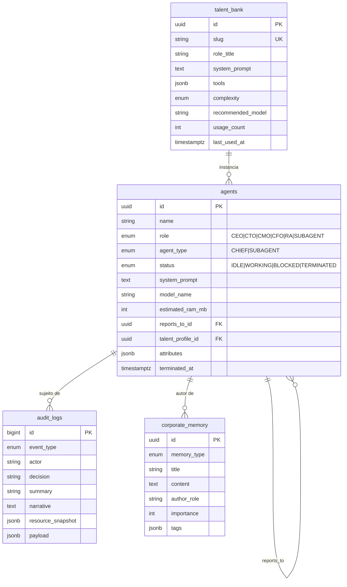
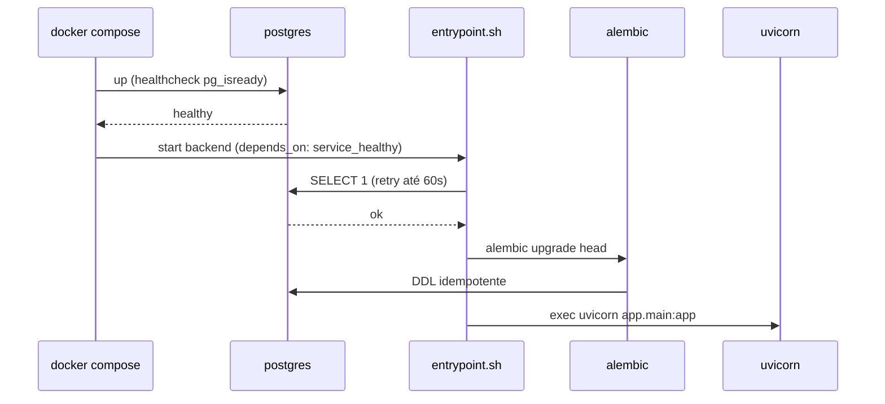
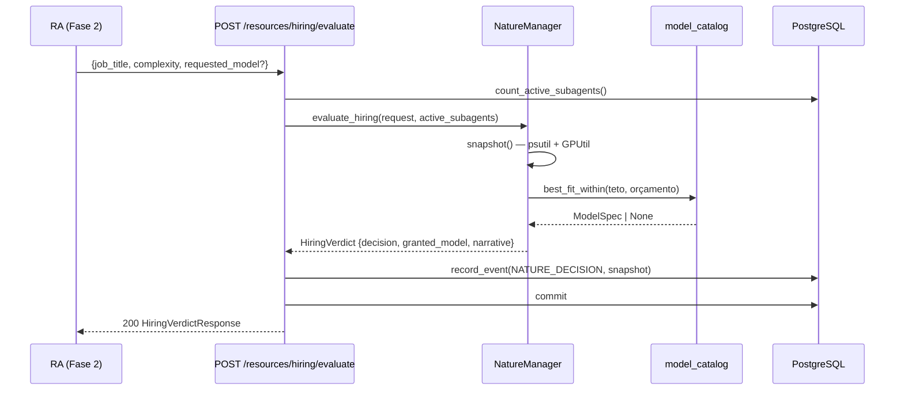

# Arquitetura do TheyWork

> **Escopo:** este documento reflete a **Fase 1 (Motor Base e Isolamento)** já implementada e
> marca explicitamente os pontos de extensão previstos para as Fases 2–4.
> Fonte de requisitos: [PRD](PRD.md). Instruções operacionais: [SETUP](SETUP.md).

---

## 1. Visão Geral

O TheyWork é um **monólito modular em camadas**, conteinerizado, que roda integralmente
offline. O backend Python (FastAPI) é o único componente com lógica de negócio; ele orquestra
três serviços de apoio — PostgreSQL (estado), Redis (cache/fila) e Ollama (inferência local).

**Princípios arquiteturais observáveis no código:**

| Princípio | Como é aplicado |
|-----------|-----------------|
| Isolamento por padrão | Três redes Docker; PostgreSQL e Redis em rede `internal` sem rota para a internet |
| Limites físicos como regra de negócio | `NatureManager` traduz RAM/VRAM em vereditos corporativos |
| Dependências explícitas | Injeção via `Depends` do FastAPI; serviços recebem *probes* e *transports* injetáveis |
| Testabilidade offline | Nenhum teste toca rede ou hardware real: SQLite em memória + `httpx.MockTransport` |
| Reprodutibilidade | Toda versão (Python, imagens Docker, libs) fixada; nenhuma tag `latest` |

### Stack

| Camada | Tecnologia | Versão |
|--------|-----------|--------|
| Runtime | Python | 3.14.8 |
| API | FastAPI / Uvicorn | 0.142.2 / 0.54.0 |
| ORM | SQLAlchemy (sync) | 2.1.3 |
| Migrações | Alembic | 1.20.0 |
| Validação | Pydantic / pydantic-settings | 2.13.5 / 2.15.0 |
| Banco | PostgreSQL | 16.11-alpine |
| Cache/Fila | Redis | 8.2.2-alpine |
| Inferência | Ollama | 0.12.11 |
| Monitoramento | psutil / GPUtil | 7.2.2 / 1.4.0 |
| Logging | structlog | 26.1.0 |

---

## 2. Topologia de Containers e Redes



**Decisão (ADR-001):** PostgreSQL e Redis ficam em rede `internal: true`, sem porta publicada.
Qualquer código gerado por um subagente que vaze para o processo do backend não consegue
exfiltrar dados do banco para fora da máquina. O acesso administrativo é feito por
`docker compose exec postgres psql`.

**Decisão (ADR-002):** `ollama` precisa de saída de rede apenas para `ollama pull`. Por isso
vive numa rede `bridge` separada, sem acesso à rede `core`. Após baixar os modelos, o serviço
pode operar indefinidamente offline.

**Decisão (ADR-003):** todas as portas publicadas são vinculadas a `127.0.0.1`, nunca a
`0.0.0.0`. A simulação não é exposta à LAN.

---

## 3. Camadas do Backend

```text
backend/app/
├── main.py          # Composition root: create_app(), middleware, lifespan
├── config/          # Infraestrutura transversal (settings, logging, engine/sessão)
├── models/          # Camada de domínio/persistência (SQLAlchemy ORM + enums)
├── schemas/         # Contratos da API (Pydantic) — fronteira de entrada/saída
├── services/        # Regras de negócio (Natureza, catálogo, agentes, auditoria, Ollama)
└── routes/          # Camada HTTP fina: traduz requisição → serviço → schema
```

**Regra de dependência (unidirecional):**



`models/` nunca importa de `services/`; `services/` nunca importa de `routes/`. Os enums de
domínio vivem em `models/enums.py` justamente para serem compartilhados por todas as camadas
sem criar ciclos.

---

## 4. Componentes Centrais

### 4.1 A Natureza (`services/nature_manager.py`)

O componente mais característico do sistema. Converte escassez física em ficção corporativa.

**Responsabilidades**
1. Amostrar RAM (psutil), VRAM (GPUtil) e CPU.
2. Classificar a infraestrutura em `HEALTHY` / `WARNING` / `CRITICAL`.
3. Emitir vereditos sobre requisições de contratação do RA.
4. Represar requisições numa fila quando não há orçamento.

**Cálculo do orçamento**

```text
ram_limit       = min(RAM física, NATURE_RAM_LIMIT_MB)
ram_usage_ratio = ram_used / ram_limit
ram_allocatable = max(ram_limit − ram_used − NATURE_RESERVED_RAM_MB, 0)

status = CRITICAL  se max(ram_ratio, vram_ratio) ≥ 0.90
         WARNING   se max(ram_ratio, vram_ratio) ≥ 0.75
         HEALTHY   caso contrário
```

A reserva (`NATURE_RESERVED_RAM_MB`, 2 GB por padrão) é o que garante que o SO e a IDE do
usuário continuem utilizáveis enquanto a empresa opera.

**Máquina de decisão**



Cada veredito carrega uma `narrative` em linguagem corporativa, que é o texto injetado no
contexto dos agentes e exibido na UI:

> *"Em regime de contenção de custos, a diretoria aprovou a vaga apenas com o perfil mais
> enxuto (Llama 3.2 3B) em vez de DeepSeek R1 8B."*

**Extensibilidade:** `NatureManager` é um `dataclass` cujas sondas (`ram_probe`, `vram_probe`,
`cpu_probe`) são callables injetáveis. Os testes substituem o hardware por funções
determinísticas; uma futura sonda de disco ou de energia entra pelo mesmo mecanismo.

### 4.2 Catálogo e Seleção de Modelos (`services/model_catalog.py`)

Estrutura de dados imutável (`tuple` de `ModelSpec` congelados) ordenada por `tier` (1 = mais
leve, 5 = mais pesado). Duas funções compõem toda a política de seleção:

- `preferred_for(complexity)` — o modelo **ideal**, ignorando restrições.
- `best_fit_within(ceiling, ram_budget_mb)` — o modelo mais capaz que cabe no orçamento **sem
  ultrapassar um teto**. Quando o RA pede um modelo específico, ele vira o teto.

A diferença entre os dois é o que define o flag `downgraded`.

| Complexidade | Modelo preferencial |
|--------------|---------------------|
| `TRIVIAL` / `SIMPLE` | `llama3.2:3b` |
| `MODERATE` | `phi4-mini:3.8b` |
| `COMPLEX` | `qwen3:8b` |
| `CRITICAL` | `deepseek-r1:8b` |

### 4.3 Serviço de Agentes (`services/agent_service.py`)

Os 5 Chiefs são definidos como `ChiefBlueprint` imutáveis, com system prompts derivados
diretamente do PRD. `init_chiefs()` é **idempotente** (reconcilia por `role`), monta a
hierarquia — todos reportam ao CEO, o CEO reporta ao usuário — e registra a criação na
auditoria antes do commit.

**Extensibilidade (Fase 2):** o RA passará a criar `TalentProfile` e instanciar `Agent` do tipo
`SUBAGENT` com `talent_profile_id` preenchido, sempre consultando
`/resources/hiring/evaluate` antes.

### 4.4 Cliente Ollama (`services/ollama_client.py`)

Wrapper assíncrono fino sobre `/api/version` e `/api/tags`. Falhas de rede são isoladas em
duas políticas distintas:

- **Degradação silenciosa** (`is_healthy`, `version`) → retorna `False`/`None` e loga. Usado no
  health check, onde a indisponibilidade é um *estado*, não um erro.
- **Exceção tipada** (`list_installed`) → `OllamaUnavailableError`, tratada explicitamente pelo
  chamador.

O `transport` é injetável, o que permite testar sem rede via `httpx.MockTransport`.

### 4.5 Auditoria (`services/audit_service.py`)

`record_event()` **não faz commit** — ele participa da transação do chamador. Isso garante que
a decisão da Natureza e o seu registro de auditoria sejam atômicos.

---

## 5. Arquitetura de Dados



**Padrões de modelagem**

| Decisão | Motivo |
|---------|--------|
| PK `UUID` gerada na aplicação | Não depende da extensão `pgcrypto`; IDs conhecidos antes do flush |
| `audit_logs` com PK `BIGINT` sequencial | Ordem de inserção é informação relevante numa trilha |
| `JSON().with_variant(JSONB, "postgresql")` | JSONB em produção, JSON genérico no SQLite dos testes |
| `BigInteger().with_variant(Integer, "sqlite")` | SQLite só autoincrementa colunas `INTEGER` |
| `DateTime(timezone=True)` + `datetime.now(UTC)` | Nenhum timestamp ingênuo entra no banco |
| `MetaData(naming_convention=...)` | Nomes determinísticos de índices/FKs → diffs de migração estáveis |
| `ondelete="SET NULL"` nas FKs de agente | A demissão de um subagente não apaga sua trilha de auditoria |

**Migrações:** o Alembic lê a URL do banco de `Settings` (nunca de `alembic.ini`), e o
`entrypoint.sh` executa `alembic upgrade head` antes de subir o Uvicorn. A revisão base é
`0001_schema_inicial`.

---

## 6. Preocupações Transversais

| Concern | Implementação |
|---------|---------------|
| **Configuração** | `Settings` (pydantic-settings) com `@lru_cache`; precedência: env > `.env` > default. Validadores cruzados garantem `critical > warning`. |
| **Logging** | `structlog` com eventos estruturados (`nature.hiring_decision`, `app.startup`). `LOG_FORMAT=json` para ingestão; `console` para desenvolvimento. |
| **Validação** | Fronteira única: schemas Pydantic nas rotas. Serviços assumem entrada já validada. |
| **Erros** | `OllamaUnavailableError` para falhas de dependência externa; `SQLAlchemyError` capturado no health check; FastAPI devolve `422` automático para payloads inválidos. |
| **Sessão de banco** | `get_db_session()` como dependência geradora — fechamento garantido no `finally`. Rotas síncronas rodam no threadpool do FastAPI. |
| **Concorrência** | A fila e o singleton da Natureza são protegidos por `threading.Lock` (o threadpool do FastAPI é multi-thread). |
| **Segurança** | Container roda como usuário não-root (uid 10001); portas em `127.0.0.1`; segredos só via `.env` (gitignored); CORS restrito a `localhost:3000`. |
| **Health** | `/health/live` (liveness, sem dependências) e `/health` (readiness agregada). O `HEALTHCHECK` do Docker usa `urllib`, sem instalar pacotes extras. |

---

## 7. Fluxos Principais

### 7.1 Inicialização do stack



### 7.2 Contratação governada pela Natureza



---

## 8. Estratégia de Testes

**66 testes, todos offline e determinísticos.** Nenhum toca rede, GPU ou PostgreSQL real.

| Arquivo | Cobre |
|---------|-------|
| `test_nature_manager.py` | Cálculo de orçamento, classificação de status, downgrade, bloqueio, fila |
| `test_model_catalog.py` | Integridade do catálogo e regra de seleção por complexidade |
| `test_settings.py` | Validação de configuração e propriedades derivadas |
| `test_persistence.py` | Schema do banco, idempotência de `init_chiefs`, auditoria, memória |
| `test_api.py` | Todos os endpoints HTTP, incluindo cenários de degradação |
| `test_ollama_client.py` | Parsing e tolerância a falhas do cliente Ollama |

**Dublês:** SQLite em memória (`StaticPool`) para o banco; `httpx.MockTransport` para o Ollama;
sondas lambda para o hardware. A substituição é feita via `app.dependency_overrides`.

---

## 9. Pontos de Extensão por Fase

| Fase | Onde encaixa |
|------|--------------|
| **2 — Societária** | `services/` ganha `ra_service.py` (Banco de Talentos) e `council_service.py` (framework de decisão). Os `TalentProfile` já têm schema e tabela prontos. |
| **3 — Observabilidade** | Callbacks ReAct serializados em `corporate_memory` / nova tabela `thought_traces`; `audit_logs.payload` (JSONB) já comporta o formato intermediário. |
| **4 — Motor 2D** | `routes/ws.py` com WebSocket; Redis (já provisionado) atua como pub/sub entre workers; CORS já liberado para `localhost:3000`. |

---

## 10. Limitações Conhecidas

| Limitação | Impacto | Mitigação |
|-----------|---------|-----------|
| GPUtil não enxerga a GPU dentro do container | `gpu_detected: false`, VRAM reportada como 0 | Subir com `docker-compose.gpu.yml` (requer NVIDIA Container Toolkit). A classificação de status cai para RAM apenas, que é o recurso mais restritivo. |
| `NatureManager` é singleton em memória | A fila de contratações não sobrevive a um restart | Redis já está provisionado para persistir a fila na Fase 2 |
| SQLAlchemy síncrono em rotas async | Handlers de banco rodam no threadpool | Adequado para a escala local; migrar para `asyncpg` só se houver gargalo medido |
| `psutil` lê a RAM do host, não do cgroup do container | Em hosts com limites de cgroup diferentes a leitura pode divergir | `NATURE_RAM_LIMIT_MB` permite fixar o teto manualmente |
