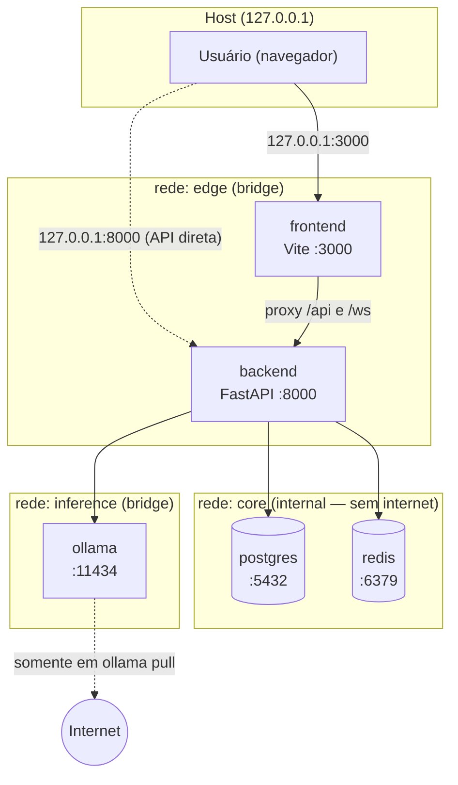
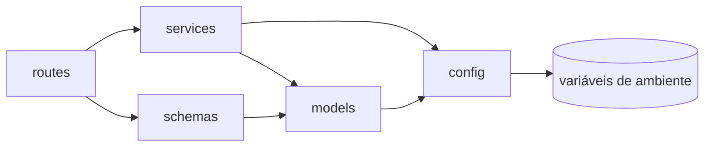
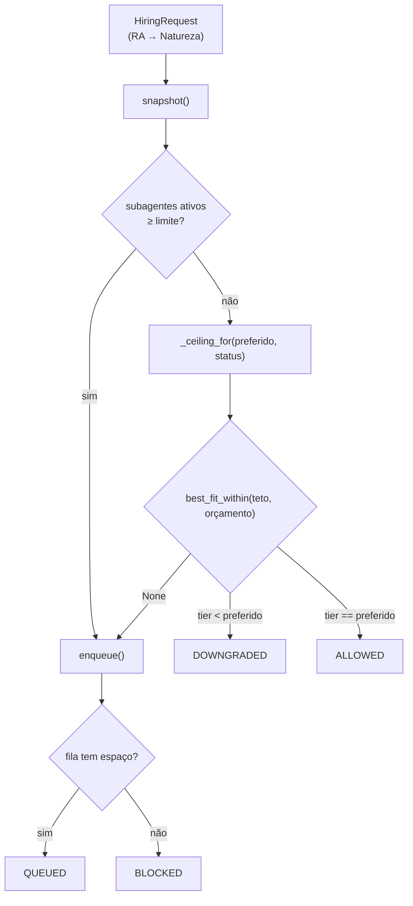
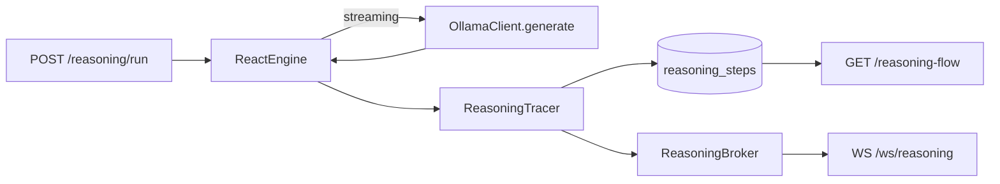
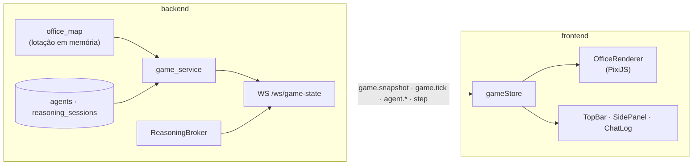
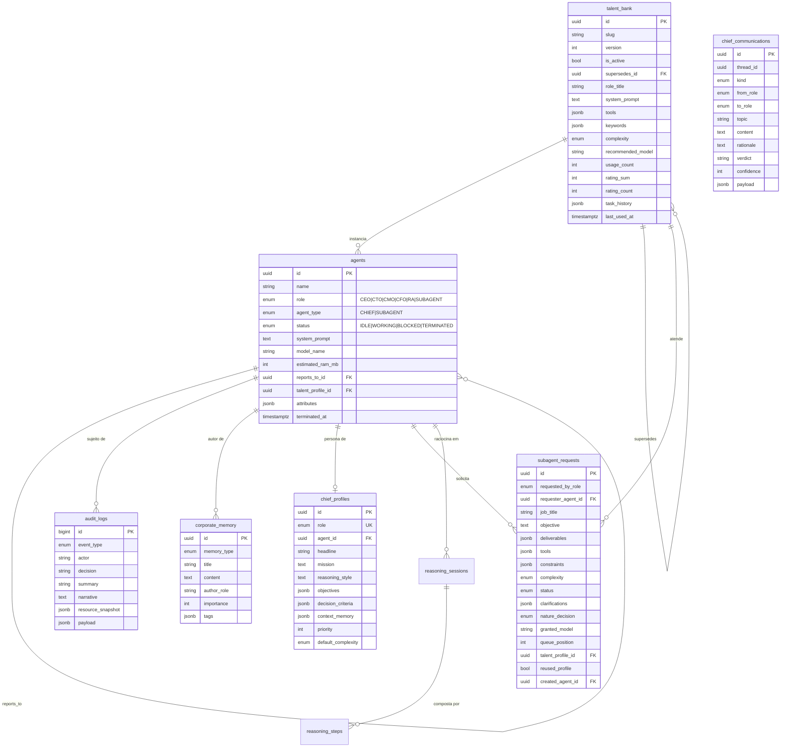
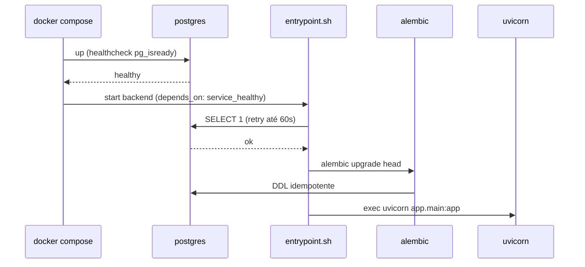
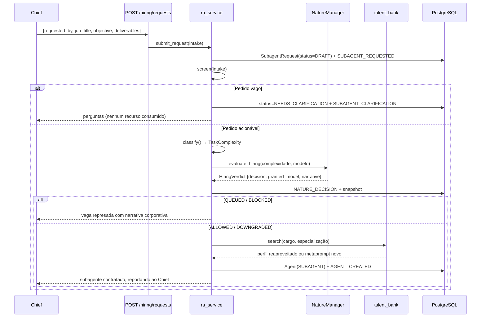

# Arquitetura do TheyWork

> **Escopo:** este documento reflete a **Fase 1 (Motor Base e Isolamento)** já implementada e
> marca explicitamente os pontos de extensão previstos para as Fases 2–4.
> Fonte de requisitos: [PRD](PRD.md). Instruções operacionais: [SETUP](SETUP.md).

---

## 1. Visão Geral

O TheyWork é um **monólito modular em camadas**, conteinerizado, que roda integralmente
offline. O backend Python (FastAPI) é o único componente com lógica de negócio; ele orquestra
três serviços de apoio — PostgreSQL (estado), Redis (cache/fila) e Ollama (inferência local).

**Princípios arquiteturais observáveis no código:**

| Princípio | Como é aplicado |
|-----------|-----------------|
| Isolamento por padrão | Três redes Docker; PostgreSQL e Redis em rede `internal` sem rota para a internet |
| Limites físicos como regra de negócio | `NatureManager` traduz RAM/VRAM em vereditos corporativos |
| Dependências explícitas | Injeção via `Depends` do FastAPI; serviços recebem *probes* e *transports* injetáveis |
| Testabilidade offline | Nenhum teste toca rede ou hardware real: SQLite em memória + `httpx.MockTransport` |
| Reprodutibilidade | Toda versão (Python, imagens Docker, libs) fixada; nenhuma tag `latest` |

### Stack

| Camada | Tecnologia | Versão |
|--------|-----------|--------|
| Runtime | Python | 3.14.8 |
| API | FastAPI / Uvicorn | 0.142.2 / 0.54.0 |
| ORM | SQLAlchemy (sync) | 2.1.3 |
| Migrações | Alembic | 1.20.0 |
| Validação | Pydantic / pydantic-settings | 2.13.5 / 2.15.0 |
| Banco | PostgreSQL | 16.11-alpine |
| Cache/Fila | Redis | 8.2.2-alpine |
| Inferência | Ollama | 0.12.11 |
| Monitoramento | psutil / GPUtil | 7.2.2 / 1.4.0 |
| Logging | structlog | 26.1.0 |

**Frontend 2D (Fase 4)**

| Camada | Tecnologia | Versão |
|--------|-----------|--------|
| Runtime | Node | 22.23.3-alpine |
| Build | Vite | 8.3.2 |
| UI | React / TypeScript | 19.3.0 / 5.9.3 |
| Canvas 2D | PixiJS | 8.22.0 |
| Estado | Zustand | 5.0.15 |
| Testes | Vitest / Testing Library | 5.0.3 / 16.3.3 |
| Lint & formato | ESLint / Prettier | 10.12.0 / 3.9.9 |

---

## 2. Topologia de Containers e Redes



**Decisão (ADR-001):** PostgreSQL e Redis ficam em rede `internal: true`, sem porta publicada.
Qualquer código gerado por um subagente que vaze para o processo do backend não consegue
exfiltrar dados do banco para fora da máquina. O acesso administrativo é feito por
`docker compose exec postgres psql`.

**Decisão (ADR-002):** `ollama` precisa de saída de rede apenas para `ollama pull`. Por isso
vive numa rede `bridge` separada, sem acesso à rede `core`. Após baixar os modelos, o serviço
pode operar indefinidamente offline.

**Decisão (ADR-003):** todas as portas publicadas são vinculadas a `127.0.0.1`, nunca a
`0.0.0.0`. A simulação não é exposta à LAN.

O `frontend` vive apenas na rede `edge` e só enxerga o `backend`: nenhum caminho leva dele
ao `postgres`, ao `redis` ou ao `ollama`. O dev server do Vite faz proxy de `/api` e `/ws`,
de modo que o navegador trafega sempre na mesma origem.

---

## 3. Camadas do Backend

```text
backend/app/
├── main.py          # Composition root: create_app(), middleware, lifespan
├── config/          # Infraestrutura transversal (settings, logging, engine/sessão)
├── models/          # Camada de domínio/persistência (SQLAlchemy ORM + enums)
├── schemas/         # Contratos da API (Pydantic) — fronteira de entrada/saída
├── services/        # Regras de negócio (Natureza, catálogo, agentes, auditoria, Ollama)
└── routes/          # Camada HTTP fina: traduz requisição → serviço → schema
```

**Regra de dependência (unidirecional):**



`models/` nunca importa de `services/`; `services/` nunca importa de `routes/`. Os enums de
domínio vivem em `models/enums.py` justamente para serem compartilhados por todas as camadas
sem criar ciclos.

---

## 4. Componentes Centrais

### 4.1 A Natureza (`services/nature_manager.py`)

O componente mais característico do sistema. Converte escassez física em ficção corporativa.

**Responsabilidades**
1. Amostrar RAM (psutil), VRAM (GPUtil) e CPU.
2. Classificar a infraestrutura em `HEALTHY` / `WARNING` / `CRITICAL`.
3. Emitir vereditos sobre requisições de contratação do RA.
4. Represar requisições numa fila quando não há orçamento.

**Cálculo do orçamento**

```text
ram_limit       = min(RAM física, NATURE_RAM_LIMIT_MB)
ram_usage_ratio = ram_used / ram_limit
ram_allocatable = max(ram_limit − ram_used − NATURE_RESERVED_RAM_MB, 0)

status = CRITICAL  se max(ram_ratio, vram_ratio) ≥ 0.90
         WARNING   se max(ram_ratio, vram_ratio) ≥ 0.75
         HEALTHY   caso contrário
```

A reserva (`NATURE_RESERVED_RAM_MB`, 2 GB por padrão) é o que garante que o SO e a IDE do
usuário continuem utilizáveis enquanto a empresa opera. Note que `ram_used` é a leitura do
**host inteiro** — navegador, IDE e demais containers entram na conta, o que é intencional:
a empresa virtual disputa a máquina com o usuário.

Por isso **a reserva é o knob de folga, não o limite**. `NATURE_RAM_LIMIT_MB` é também o
denominador do percentual de saúde; configurá-lo abaixo da RAM física distorce o ratio
(`ram_used` continua sendo o do host e pode superar o teto, levando a um `CRITICAL`
permanente com orçamento zero). Mantenha o limite no teto físico e use a reserva para
decidir quanto da máquina fica fora do alcance da empresa.

**Calibração: reserva × limiares**

Os dois mecanismos protegem o mesmo recurso, então o mais restritivo vence. Para que o
regime de contenção chegue a *conceder* um modelo por pressão de **RAM** (em vez de apenas
represar a vaga), vale a relação:

```text
NATURE_RESERVED_RAM_MB + 2048  ≤  (1 − NATURE_WARNING_THRESHOLD) × ram_limit
                        ↑
          RAM do modelo mais leve (Llama 3.2 3B)
```

Quando ela não vale, a reserva **domina** os limiares: sair de `HEALTHY` já zera o orçamento
e toda contratação vai para a fila sem passar pelo downgrade. Com os valores padrão
(16384 / 2048 / 0.75) a igualdade fica no limite exato — a banda de contenção por RAM é de
um único ponto. O teste `test_reserva_domina_os_limiares_na_configuracao_do_projeto` fixa
esse comportamento para que a mudança seja consciente.

Isso **não** torna o teto por regime supérfluo: como `ram_used` e `ram_allocatable` são
duas leituras da mesma variável, o orçamento já resolve a pressão de RAM sozinho — mas ele
não enxerga a GPU. O teto é o único canal pelo qual a **saturação de VRAM** influencia a
escolha do modelo, e aí ele decide de fato (há RAM de sobra, porém o regime é crítico).

**Máquina de decisão**



O regime da infraestrutura **rebaixa o teto** em vez de desviar o fluxo: `CRITICAL` fixa o
teto no modelo mais leve, `WARNING` desce um tier, `HEALTHY` mantém o preferido. Com isso
existe uma única regra de seleção (`best_fit_within`) e nenhum ramo que prometa um veredito
que não consegue entregar.

Cada veredito carrega uma `narrative` em linguagem corporativa, que é o texto injetado no
contexto dos agentes e exibido na UI:

> *"Em regime de contenção de custos, a diretoria aprovou a vaga apenas com o perfil mais
> enxuto (Llama 3.2 3B) em vez de DeepSeek R1 8B."*

**Extensibilidade:** `NatureManager` é um `dataclass` cujas sondas (`ram_probe`, `vram_probe`,
`cpu_probe`) são callables injetáveis. Os testes substituem o hardware por funções
determinísticas; uma futura sonda de disco ou de energia entra pelo mesmo mecanismo.

### 4.2 Catálogo e Seleção de Modelos (`services/model_catalog.py`)

Estrutura de dados imutável (`tuple` de `ModelSpec` congelados) ordenada por `tier` (1 = mais
leve, 5 = mais pesado). Duas funções compõem toda a política de seleção:

- `preferred_for(complexity)` — o modelo **ideal**, ignorando restrições.
- `best_fit_within(ceiling, ram_budget_mb)` — o modelo mais capaz que cabe no orçamento **sem
  ultrapassar um teto**. Quando o RA pede um modelo específico, ele vira o teto.

A diferença entre os dois é o que define o flag `downgraded`.

| Complexidade | Modelo preferencial |
|--------------|---------------------|
| `TRIVIAL` / `SIMPLE` | `llama3.2:3b` |
| `MODERATE` | `phi4-mini:3.8b` |
| `COMPLEX` | `qwen3:8b` |
| `CRITICAL` | `deepseek-r1:8b` |

### 4.3 Serviço de Agentes (`services/agent_service.py`)

Os 5 Chiefs são definidos como `ChiefBlueprint` imutáveis, com system prompts derivados
diretamente do PRD. `init_chiefs()` é **idempotente** (reconcilia por `role`), monta a
hierarquia — todos reportam ao CEO, o CEO reporta ao usuário — e registra a criação na
auditoria antes do commit. `get_chief(role)` e `count_active_subagents()` são os pontos de
entrada usados pelo RA e pela Natureza.

### 4.3.1 Conselho Administrativo (`services/council_service.py`)

Cada persona C-Level herda de `ChiefAgent` e implementa `analyze(proposal) -> ChiefOpinion`
com critérios próprios e **determinísticos** — nenhuma inferência de LLM é gasta para
deliberar, o que mantém a decisão auditável e reproduzível.

- **CTO** tem poder de **veto**: sinais inviáveis para o hardware alvo bloqueiam a proposta
  independentemente da maioria.
- **CMO** exige público-alvo; **CFO** exige modelo de monetização.
- **CEO** não vota com as diretorias: consolida o resultado em `APPROVED`,
  `APPROVED_WITH_CONDITIONS` ou `REJECTED`.
- **RA** sempre se abstém em pauta de produto.

Cada deliberação gera 5 linhas em `chief_communications` (pauta + 3 pareceres + decisão) e
um evento `COUNCIL_DELIBERATION`. `chief_profiles.context_memory` guarda os 25 fatos
corporativos mais recentes de cada Chief. Detalhes em [CHIEF-LOGIC.md](CHIEF-LOGIC.md).

### 4.3.2 Recursos Agênticos (`services/ra_service.py`)

O RA é o único componente autorizado a criar `Agent` do tipo `SUBAGENT`. O pipeline é
linear e cada etapa deixa rastro de auditoria:

1. **Triagem** (`screen`) — devolve perguntas ao Chief quando o pedido está vago, **sem
   consumir recursos de infraestrutura**.
2. **Classificação** (`complexity_classifier`) — estima o peso cognitivo a partir do texto.
3. **Auditoria da Natureza** — `evaluate_hiring()` aprova, rebaixa o modelo, enfileira ou
   bloqueia.
4. **Banco de Talentos** — reaproveita o metaprompt existente ou redige um novo
   (`prompt_factory`).
5. **Instanciação** — o subagente é criado com o modelo concedido e passa a reportar ao
   Chief solicitante.
6. **Demissão** — libera a RAM contabilizada, arquiva o relatório final em
   `corporate_memory` e credita a nota de desempenho ao perfil.

Detalhes em [HIRING-FLOW.md](HIRING-FLOW.md) e [TALENT-BANK.md](TALENT-BANK.md).

**Extensibilidade (Fase 3):** o metaprompt gerado pelo `prompt_factory` é o ponto de
enganche natural para a interceptação do fluxo ReAct.

### 4.4 Cliente Ollama (`services/ollama_client.py`)

Wrapper assíncrono fino sobre `/api/version` e `/api/tags`. Falhas de rede são isoladas em
duas políticas distintas:

- **Degradação silenciosa** (`is_healthy`, `version`) → retorna `False`/`None` e loga. Usado no
  health check, onde a indisponibilidade é um *estado*, não um erro.
- **Exceção tipada** (`list_installed`) → `OllamaUnavailableError`, tratada explicitamente pelo
  chamador.

O `transport` é injetável, o que permite testar sem rede via `httpx.MockTransport`.

### 4.5 Auditoria (`services/audit_service.py`)

`record_event()` **não faz commit** — ele participa da transação do chamador. Isso garante que
a decisão da Natureza e o seu registro de auditoria sejam atômicos.

### 4.6 Classificador de Complexidade (`services/complexity_classifier.py`)

Heurística lexical determinística: normaliza o texto (minúsculas, sem acentuação), soma
pesos de palavras-chave, aplica ajustes de escopo (número de entregáveis, ferramentas e
tamanho do briefing) e converte o score em `TaskComplexity`. Um **piso por cargo** impede
que uma vaga pedida pelo CTO caia abaixo de `MODERATE`.

A escolha por heurística, e não por inferência, é deliberada: decidir qual modelo usar não
pode custar uma rodada de LLM.

### 4.7 Fábrica de Metaprompts (`services/prompt_factory.py`)

Monta o system prompt do subagente em seções fixas (objetivo, entregáveis, ferramentas,
restrições, formato de saída). As `BASE_CONSTRAINTS` são invariantes do domínio: nenhum
subagente pode instanciar outros agentes nem acessar recursos externos, e todo subagente
deve produzir um relatório final — o único artefato que sobrevive à sua demissão.

### 4.8 Observabilidade Cognitiva (Fase 3)

O raio-X do pensamento dos agentes. Cinco módulos, cada um com uma responsabilidade única:

| Módulo | Responsabilidade |
|--------|------------------|
| `services/react_engine.py` | Loop ReAct: monta o prompt, chama o modelo, faz o parse dos rótulos, executa a ferramenta e repete até a conclusão ou o teto de passos |
| `services/reasoning_tracer.py` | Ponto único de captura: persiste cada passo, acumula tokens e publica no barramento |
| `services/reasoning_broker.py` | Pub/sub em memória, um canal por agente + canal global, com backpressure |
| `services/reasoning_tools.py` | Cinco ferramentas 100% offline, cada uma devolvendo texto legível + payload estruturado |
| `services/reasoning_flow.py` | Serializa a sequência linear de passos no grafo que o frontend desenha |
| `services/reasoning_metrics.py` | Tokens, tempo, taxa de sucesso, custo em MB·s, ROI, retenção e export |



**ADR-004 — wrapper próprio em vez de LangGraph/CrewAI.** O PRD sugeria essas bibliotecas,
mas elas arrastam dezenas de dependências transitivas sem pin (conflitando com a regra de
reprodutibilidade do projeto), assumem rede disponível e escondem o prompt real atrás de
abstrações. Como a interceptação é trivial sobre o streaming nativo do Ollama
(`POST /api/generate`), o loop foi escrito à mão: ~180 linhas, zero dependências novas e
controle total sobre o que entra na trilha de auditoria.

**ADR-005 — uma tabela com discriminador.** `reasoning_steps` guarda os quatro tipos de nó
(`THOUGHT`, `ACTION`, `OBSERVATION`, `CONCLUSION`) num único esquema, ordenados por
`sequence`. Quatro tabelas separadas teriam colunas idênticas e exigiriam quatro JOINs para
reconstruir o fluxograma.

**ADR-006 — broker em memória, não Redis.** O backend roda num único worker; o Redis entra
como transporte na Fase 4, quando houver mais de um processo. A troca não toca nas rotas
porque `ReasoningBroker` é a única superfície que elas enxergam. `publish` usa
`loop.call_soon_threadsafe`, portanto funciona tanto do threadpool das rotas síncronas
quanto de código assíncrono.

**ADR-007 — captura síncrona na transação do agente.** O passo é gravado e publicado no
mesmo ponto do código. Sem fila intermediária não há como perder passo nem reordená-lo.

**Offline-first.** Se o Ollama estiver fora do ar ou o modelo exigido não tiver sido baixado,
um planejador determinístico assume o lugar do LLM: escolhe uma ferramenta por heurística
lexical, executa a consulta de verdade e conclui com base na observação. A simulação
continua observável; muda apenas `total_tokens = 0`.

Detalhamento: [`REASONING-FORMAT.md`](REASONING-FORMAT.md),
[`FLOWCHART-SCHEMA.md`](FLOWCHART-SCHEMA.md) e [`API-REASONING.md`](API-REASONING.md).

### 4.9 Mundo 2D (Fase 4)

| Módulo | Responsabilidade |
|--------|------------------|
| `services/office_map.py` | Planta do escritório (40×24 tiles) e lotação determinística dos agentes |
| `services/game_service.py` | Projeção de leitura: quadro de pessoal + lotação + recursos + relógio + economia |
| `routes/game.py` | `GET /game/map`, `GET /game/state`, `GET/POST` de posição e movimento |
| `routes/ws.py` | `WS /ws/game-state`: snapshot inicial, eventos cognitivos e *diffs* a cada tick |



**ADR-008 — PixiJS como motor 2D.** O escritório é um mapa top-down pequeno, sem física e
com poucas dezenas de sprites. Babylon.js (3D completo) e Phaser 3 (loop de jogo, cenas e
input próprios) resolveriam muito mais do que o problema exige e duplicariam o
gerenciamento de estado que já vive no React/Zustand. PixiJS é um renderizador WebGL fino:
o React continua dono do estado e o canvas só desenha o snapshot que recebe.

**ADR-009 — sprites procedurais.** Avatares, móveis e ícones são desenhados com `Graphics`
a partir de uma paleta de 16 bits e cacheados como textura (`engine/textures.ts`). Nenhum
binário de arte é versionado e nenhum download acontece em tempo de execução. Trocar de
tema é trocar a paleta (`THEMES.dark` / `THEMES.light`): o renderizador repinta piso,
cômodos, rótulos e balões sem recriar sprite algum.

**ADR-010 — posições em memória, não no banco.** Nenhum modelo ORM tem coordenadas. A
lotação vive num registro por processo (`OfficeMap`), com a mesma disciplina do broker:
*lock* + instância via `lru_cache`. A atribuição é determinística — Chief na mesa do cargo,
subagente na estação livre de menor índice ordenado por `created_at` — então reiniciar o
backend recoloca todo mundo no lugar canônico. A Fase 4 não precisou de migração.

**ADR-011 — `/ws/game-state` reaproveita o barramento da Fase 3.** Eventos cognitivos
(`session.started`, `step`, `session.finished`) atravessam o canal sem tradução. O que não
emite evento próprio — contratação, demissão, mudança de regime da Natureza — é detectado
por *diff* entre dois snapshots consecutivos a cada `GAME_TICK_SECONDS`. Nenhum serviço das
Fases 2 e 3 precisou ser alterado; o custo é a latência de um tick nesses casos.

Detalhamento da interface: [`frontend/README.md`](../frontend/README.md).

---

## 5. Arquitetura de Dados



**Padrões de modelagem**

| Decisão | Motivo |
|---------|--------|
| PK `UUID` gerada na aplicação | Não depende da extensão `pgcrypto`; IDs conhecidos antes do flush |
| `audit_logs` com PK `BIGINT` sequencial | Ordem de inserção é informação relevante numa trilha |
| `JSON().with_variant(JSONB, "postgresql")` | JSONB em produção, JSON genérico no SQLite dos testes |
| `BigInteger().with_variant(Integer, "sqlite")` | SQLite só autoincrementa colunas `INTEGER` |
| `DateTime(timezone=True)` + `datetime.now(UTC)` | Nenhum timestamp ingênuo entra no banco |
| `MetaData(naming_convention=...)` | Nomes determinísticos de índices/FKs → diffs de migração estáveis |
| `ondelete="SET NULL"` nas FKs de agente | A demissão de um subagente não apaga sua trilha de auditoria |
| Unicidade `(slug, version)` em `talent_bank` | Permite versionar metaprompts sem perder o histórico |
| Tipos enum reaproveitados nas migrações (`create_type=False`) | PostgreSQL falha ao recriar um tipo existente; a 0002 só cria `communication_kind`, `request_status` e `nature_decision` |

**Migrações:** o Alembic lê a URL do banco de `Settings` (nunca de `alembic.ini`), e o
`entrypoint.sh` executa `alembic upgrade head` antes de subir o Uvicorn. Revisões:
`0001_schema_inicial` → `0002_fase_2_sociedade`.

---

## 6. Preocupações Transversais

| Concern | Implementação |
|---------|---------------|
| **Configuração** | `Settings` (pydantic-settings) com `@lru_cache`; precedência: env > `.env` > default. Validadores cruzados garantem `critical > warning`. |
| **Logging** | `structlog` com eventos estruturados (`nature.hiring_decision`, `app.startup`). `LOG_FORMAT=json` para ingestão; `console` para desenvolvimento. |
| **Validação** | Fronteira única: schemas Pydantic nas rotas. Serviços assumem entrada já validada. |
| **Erros** | `OllamaUnavailableError` para falhas de dependência externa; `SQLAlchemyError` capturado no health check; FastAPI devolve `422` automático para payloads inválidos. |
| **Sessão de banco** | `get_db_session()` como dependência geradora — fechamento garantido no `finally`. Rotas síncronas rodam no threadpool do FastAPI. |
| **Concorrência** | A fila e o singleton da Natureza são protegidos por `threading.Lock` (o threadpool do FastAPI é multi-thread). |
| **Segurança** | Container roda como usuário não-root (uid 10001); portas em `127.0.0.1`; segredos só via `.env` (gitignored); CORS restrito a `localhost:3000`. |
| **Health** | `/health/live` (liveness, sem dependências) e `/health` (readiness agregada). O `HEALTHCHECK` do Docker usa `urllib`, sem instalar pacotes extras. |

---

## 7. Fluxos Principais

### 7.1 Inicialização do stack



### 7.2 Contratação governada pela Natureza



### 7.3 Deliberação do conselho

```mermaid
sequenceDiagram
    participant U as POST /council/deliberate
    participant CS as council_service
    participant T as CTO / CMO / CFO
    participant CEO as CEO
    participant DB as PostgreSQL

    U->>CS: Proposal {topic, description}
    CS->>DB: ChiefCommunication(DIRECTIVE)
    loop Cada diretoria
        CS->>T: analyze(proposal)
        T-->>CS: ChiefOpinion {stance, confidence, concerns}
        CS->>DB: ChiefCommunication(ANALYSIS)
    end
    CS->>CEO: _resolve(pareceres)
    Note over CEO: veto do CTO é bloqueante;<br/>maioria favorável → aprovação condicionada
    CEO-->>CS: CouncilOutcome + condições
    CS->>DB: ChiefCommunication(DECISION) + COUNCIL_DELIBERATION
    CS-->>U: CouncilDecision
```

---

## 8. Estratégia de Testes

**286 testes no backend e 69 no frontend — todos offline e determinísticos.** Nenhum toca
rede, GPU, WebGL ou PostgreSQL real.

| Arquivo | Cobre |
|---------|-------|
| `test_nature_manager.py` | Orçamento, teto por regime, bloqueio, fila FIFO e alertas |
| `test_api_fase2.py` | Conselho, RA, Banco de Talentos, Natureza e fluxo ponta a ponta |
| `test_api_fase3.py` | Execução observável, fluxograma, status ao vivo, métricas, retenção, WebSocket e overhead |
| `test_api_fase4.py` | Planta, estado do mundo, movimentação e o canal `/ws/game-state` |
| `test_office_map.py` | Geometria da planta, lotação determinística, bench e relógio corporativo |
| `test_ra_service.py` | Triagem, esclarecimento, contratação, demissão, carga e concorrência |
| `test_talent_bank.py` | Slug, palavras-chave, busca, versionamento, uso e avaliação |
| `test_council_service.py` | Raciocínio de cada persona, veto do CTO e desempate do CEO |
| `test_react_engine.py` | Parser ReAct, loop, teto de passos, ferramentas e fallback offline |
| `test_reasoning_tracer.py` | Captura por tipo de passo, totais, auditoria e barramento pub/sub |
| `test_reasoning_flow.py` | Nós, arestas, aresta de ciclo, dicas de layout e status ao vivo |
| `test_reasoning_metrics.py` | Agregações, custo, ROI, política de retenção e export |
| `test_model_catalog.py` | Integridade do catálogo, seleção por complexidade e `tier_below` |
| `test_api.py` | Endpoints da Fase 1, incluindo cenários de degradação |
| `test_persistence.py` | Schema do banco, idempotência de `init_chiefs`, auditoria, memória |
| `test_complexity_classifier.py` | Heurística lexical, ajustes de escopo e piso por cargo |
| `test_settings.py` | Validação de configuração e propriedades derivadas |
| `test_ollama_client.py` | Parsing, streaming de `generate` e tolerância a falhas |

No frontend (`frontend/src/**/*.test.ts[x]`, jsdom):

| Arquivo | Cobre |
|---------|-------|
| `store/gameStore.test.ts` | Reducer de todos os eventos do canal, pausa com represamento e notificações |
| `store/uiStore.test.ts` | Seleção, abas, limites de zoom, pan, enquadramento automático e tema |
| `services/socket.test.ts` | Desserialização, backoff exponencial, watchdog de silêncio e `dispose` |
| `services/http.test.ts` | URL, query string, serialização do corpo e `ApiError` |
| `engine/layoutMath.test.ts` | Conversão de tiles, enquadramento, *clamp* da câmera, culling e rota em L |
| `hooks/useKeyboardShortcuts.test.tsx` | Atalhos globais e a guarda contra digitação em campos |
| `components/*.test.tsx` | Barra superior, painel lateral, fluxograma, log e notificações |

**Dublês:** SQLite em memória (`StaticPool`) para o banco; `httpx.MockTransport` para o Ollama
(incluindo respostas ReAct roteirizadas em NDJSON); sondas lambda para o hardware. A
substituição é feita via `app.dependency_overrides` — que também vale para as rotas
WebSocket. No frontend, o `WebSocket` é injetado por fábrica e o `OfficeRenderer` nunca é
montado: a lógica testável do canvas vive em `engine/layoutMath.ts`, sem depender de WebGL.

**Concorrência:** exercitada sobre o `NatureManager` (`ThreadPoolExecutor`), que é o estado
mutável compartilhado. A escrita no banco permanece sequencial nos testes porque a `Session`
do SQLAlchemy não é thread-safe.

---

## 9. Pontos de Extensão por Fase

| Fase | Onde encaixa |
|------|--------------|
| **2 — Societária** | ✅ Concluída: `council_service.py`, `ra_service.py`, `talent_bank.py`, `complexity_classifier.py` e `prompt_factory.py`. |
| **3 — Observabilidade** | ✅ Concluída: `react_engine.py`, `reasoning_tracer.py`, `reasoning_broker.py`, `reasoning_tools.py`, `reasoning_flow.py`, `reasoning_metrics.py` e `routes/ws.py`. |
| **4 — Motor 2D** | ✅ Concluída: `office_map.py`, `game_service.py`, `routes/game.py`, `WS /ws/game-state` e o pacote `frontend/` (PixiJS + React + Zustand). |
| **Próximos passos** | Redis como transporte do `ReasoningBroker` (multi-worker); execução de `reasoning/run` em background; persistir a fila da Natureza. |

---

## 10. Limitações Conhecidas

| Limitação | Impacto | Mitigação |
|-----------|---------|-----------|
| GPUtil não enxerga a GPU dentro do container | `gpu_detected: false`, VRAM reportada como 0 | Subir com `docker-compose.gpu.yml` (requer NVIDIA Container Toolkit). A classificação de status cai para RAM apenas, que é o recurso mais restritivo. |
| `NatureManager` é singleton em memória | A fila de contratações não sobrevive a um restart | Redis já está provisionado para persistir a fila na Fase 2 |
| SQLAlchemy síncrono em rotas async | Handlers de banco rodam no threadpool | Adequado para a escala local; migrar para `asyncpg` só se houver gargalo medido |
| `psutil` lê a RAM do host, não do cgroup do container | Em hosts com limites de cgroup diferentes a leitura pode divergir | `NATURE_RAM_LIMIT_MB` permite fixar o teto manualmente |
| Raciocínio dos Chiefs é lexical, não inferencial | Propostas com sinônimos fora das listas podem ser mal classificadas | Deliberação determinística é um requisito de auditoria; a inferência real já existe via `POST /agents/{id}/reasoning/run` |
| `POST /reasoning/run` é síncrono | Uma tarefa com modelo grande pode segurar a conexão HTTP por dezenas de segundos | Os passos já chegam ao vivo pelo WebSocket; a execução em background fica para uma fase futura |
| `ReasoningBroker` vive no processo | Com mais de um worker Uvicorn, um cliente só recebe os eventos do worker a que se conectou | Trocar o transporte por Redis pub/sub (ADR-006); a interface pública não muda |
| Rotas síncronas chamam o Ollama via `asyncio.run` | Um event loop novo por requisição | Custo irrelevante diante da latência do LLM; mantém todo o backend síncrono e previsível |
| Posições do escritório não persistem | Reiniciar o backend desfaz movimentos manuais | A lotação é determinística (ADR-010): todo mundo volta ao posto canônico |
| `agent.joined`/`agent.left` dependem do *diff* de snapshot | Chegam com até um `GAME_TICK_SECONDS` de atraso | Aceitável para um sandbox; emitir evento direto exigiria tocar os serviços das Fases 2 e 3 |
| `/ws/game-state` roda consultas SQLAlchemy síncronas no event loop | Um tick longo pode atrasar o envio de eventos | Mesmo padrão já usado em `/ws/agents/{id}/reasoning`; o snapshot é uma única passada pelo banco |
