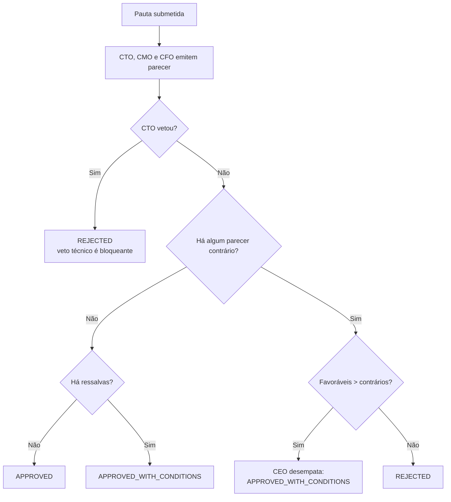

# Lógica das Personas C-Level

Como cada Chief raciocina, o que o faz aprovar ou vetar uma proposta e como o CEO resolve
impasses. Toda a deliberação é **determinística e offline** — nenhuma inferência de LLM é
gasta para decidir; o resultado é auditável e reproduzível.

Implementação: [`backend/app/services/council_service.py`](../backend/app/services/council_service.py).

---

## 1. Estrutura comum (`ChiefAgent`)

Toda persona herda de `ChiefAgent` e declara:

| Atributo | Significado |
|----------|-------------|
| `role` | Cargo (`CEO`, `CTO`, `CMO`, `CFO`, `RA`) |
| `mission` | Mandato permanente da diretoria |
| `reasoning_style` | Como o Chief estrutura o raciocínio |
| `objectives` | Metas perseguidas em toda deliberação |
| `decision_criteria` | Regras explícitas de aprovação/veto |
| `priority` | Peso do cargo (CEO = 10, RA = 4) |
| `default_complexity` | Peso cognitivo padrão das tarefas do cargo |

O método abstrato `analyze(proposal) -> ChiefOpinion` devolve posição
(`APPROVE` / `REJECT` / `ABSTAIN`), confiança (1–10), justificativa e ressalvas.

Os atributos são materializados na tabela `chief_profiles` por
`council_service.init_profiles()` — operação idempotente que também vincula cada perfil ao
`Agent` correspondente.

### Memória de contexto corporativo

`council_service.remember(session, role, fato)` acumula fatos em
`chief_profiles.context_memory`, limitados aos **25 mais recentes**. Esse contexto é
reinjetado a cada deliberação, então manter a lista enxuta evita inflar o prompt.

---

## 2. As cinco personas

### CEO — visão macro e desempate

- **Aprova** quando identifica alinhamento estratégico (`estrategia`, `visao`,
  `longo prazo`, `pivotar`, `mercado`).
- **Abstém-se** quando a proposta não conecta a iniciativa à estratégia, registrando a
  ressalva e aguardando os pareceres técnicos.
- Não vota junto às diretorias: **consolida** o resultado (ver §3).

### CTO — viabilidade técnica (poder de veto)

- **Veta** (confiança 9) ao detectar sinais inviáveis para 16 GB de RAM / 4 GB de VRAM:
  `treinar modelo`, `fine-tuning`, `cluster`, `nuvem`, `kubernetes`, `gpu dedicada`,
  `milhoes de usuarios`, `escala global`, `tempo real massivo`.
- **Aprova com ressalva** quando há dados sensíveis (`dados sensiveis`, `senha`,
  `pagamento`, `pessoais`, `pii`): exige revisão de segurança antes do primeiro commit.

### CMO — mercado e persona

- **Rejeita** se não houver público-alvo identificável (`mercado`, `cliente`, `publico`,
  `persona`, `concorrente`).
- **Aprova com ressalva** se o público existe mas o canal de aquisição não foi
  especificado (`marca`, `campanha`, `canal`, `posicionamento`, `lancamento`).

### CFO — monetização e caixa

- **Rejeita** se a proposta não explica como a empresa ganha dinheiro (`receita`, `preco`,
  `assinatura`, `monetizacao`, `margem`, `faturamento`, `licenca`).
- **Aprova com ressalva** se há receita mas o custo de execução não foi estimado
  (`custo`, `investimento`, `orcamento`, `caixa`, `despesa`).

### RA — Recursos Agênticos

Sempre **`ABSTAIN`** em pauta de produto. O RA não delibera sobre negócio: sua função é o
pipeline de contratação ([HIRING-FLOW.md](HIRING-FLOW.md)).

---

## 3. Resolução de impasses pelo CEO

Regras, na ordem em que são aplicadas:

1. **Veto técnico do CTO é bloqueante.** Nenhuma maioria o sobrepõe.
2. **Unanimidade sem ressalvas** → `APPROVED`.
3. **Unanimidade com ressalvas** → `APPROVED_WITH_CONDITIONS` (as ressalvas viram condições).
4. **Maioria favorável** → o CEO desempata a favor, condicionando à resolução das ressalvas.
5. **Caso contrário** → `REJECTED`, com os motivos contrários citados na narrativa.

Toda deliberação gera **5 registros** em `chief_communications` (1 pauta + 3 pareceres +
1 decisão do CEO), espelhados na trilha de auditoria como `CHIEF_COMMUNICATION`, mais um
evento consolidado `COUNCIL_DELIBERATION`.

---

## 4. Endpoints

| Método | Rota | O que faz |
|--------|------|-----------|
| `POST` | `/council/profiles/init` | Materializa os 5 perfis (idempotente) |
| `GET` | `/council/profiles` | Perfis ordenados por prioridade |
| `POST` | `/council/deliberate` | Submete uma pauta e recebe o veredito |
| `GET` | `/council/communications` | Histórico, filtrável por `thread_id` |
| `POST` | `/council/profiles/{role}/memory` | Grava um fato na memória do Chief |

---

## 5. Limitações conhecidas

- O raciocínio é **lexical**: baseia-se na presença de termos normalizados (sem acento,
  minúsculos). Propostas escritas com sinônimos fora das listas podem ser mal classificadas.
- Nenhum Chief consulta o Ollama ainda. A integração de inferência real está prevista para
  a Fase 3, quando o fluxo ReAct passar a ser interceptado.
