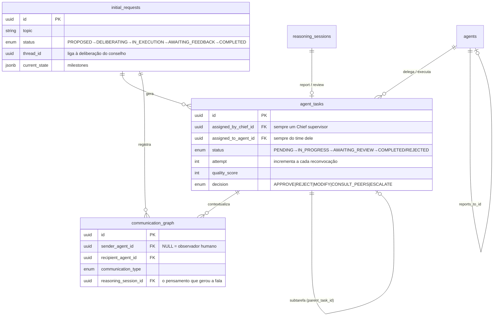
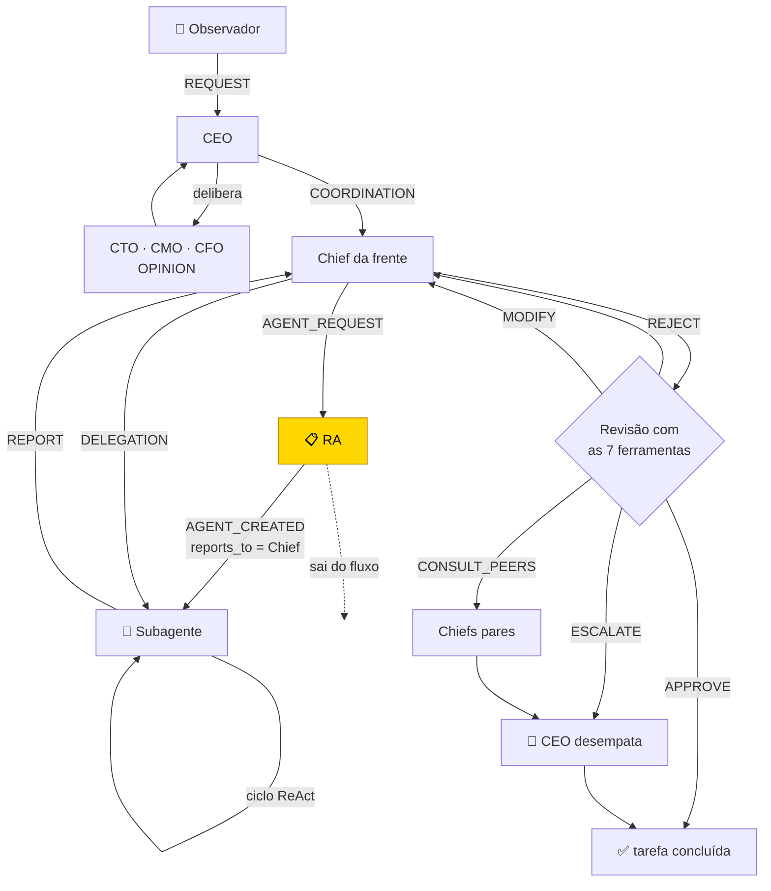

# Grafo de Comunicações Corporativas (Fase 5)

Como um pedido do observador vira uma rede de conversas, delegações e vereditos entre os
agentes — e por que o desenho é um **DAG hierárquico**, não um pipeline linear.

---

## 1. A invariante que sustenta tudo

> **Um Chief supervisor delega e recebe report. O RA cria agentes e sai do fluxo.**

| Papel | Delega? | Recebe report? | Cria agentes? |
|---|---|---|---|
| CEO | sim | sim | não |
| CTO / CMO / CFO | sim | sim | não |
| **RA** | **não** | **não** | **sim (só a pedido de um Chief)** |
| Subagente | não | não | não |

O vínculo de supervisão é a coluna `agents.reports_to_id`, criada na Fase 2 e reaproveitada
aqui (ADR-012). Quando o RA instancia um agente a pedido do CTO,
`communication_service.request_agent()` grava `agent.reports_to_id = CTO.id`: o agente nasce
subordinado a quem pediu, não a quem o criou.

Duas guardas no `communication_service` tornam a invariante inquebrável:

```python
_require_supervisor(chief)              # RA e subagentes nunca delegam
agent.reports_to_id != chief.id → erro  # um Chief só delega para o próprio time
```

Ambas levantam `HierarchyError`, que a camada HTTP traduz em `409 Conflict`.

---

## 2. Modelo de dados



`communication_graph.sender_agent_id` nulo é o **observador**: ele não é um agente, mas
precisa existir como nó de origem do pedido. No JSON do grafo ele vira o nó sintético
`"observer"`.

---

## 3. Os 10 tipos de aresta

| Tipo | De → Para | Quando |
|---|---|---|
| `REQUEST` | observador → CEO | o pedido é submetido |
| `OPINION` | CTO/CMO/CFO → CEO | parecer na deliberação |
| `COORDINATION` | CEO → Chief | alocação da frente de trabalho |
| `AGENT_REQUEST` | Chief → RA | "preciso de um Engenheiro de Software" |
| `AGENT_CREATED` | RA → novo agente | o RA entrega o agente com metaprompt |
| `DELEGATION` | Chief → subordinado | tarefa colocada na fila |
| `REPORT` | subordinado → **seu** Chief | entrega concluída |
| `DECISION` | Chief → subordinado | veredito da revisão |
| `CONSULTATION` | Chief → Chief par | a entrega afeta outra diretoria |
| `ESCALATION` | Chief → CEO | divergência ou risco alto |

---

## 4. O ciclo completo



`REJECT` reconvoca o **mesmo** agente (`attempt + 1`); `MODIFY` abre uma subtarefa ligada
por `parent_task_id`. Nos dois casos quem redelega é sempre o supervisor original da tarefa
— mesmo quando foi o CEO quem decidiu.

---

## 5. As 7 ferramentas de revisão

Registradas em `reasoning_tools.TOOLS`, acessíveis ao Chief durante o ciclo ReAct porque
`ToolContext` carrega o `task_id` da tarefa sob análise. Toda a lógica mora em
`services/report_analysis.py` — determinística, offline e sem dependência de rede.

| Ferramenta | Devolve |
|---|---|
| `avaliar_qualidade_report` | escore 0–100 (completude, clareza, estrutura, critérios de aceitação) |
| `comparar_vs_objetivo` | cobertura do objetivo + lista de lacunas |
| `checar_riscos` | riscos por categoria (`SECURITY`, `FINANCE`, …) e severidade |
| `precedentes_corporativos` | decisões passadas que servem de precedente |
| `estimar_custo_beneficio` | ROI de aprovar × modificar × rejeitar |
| `proximos_passos` | próximas tarefas derivadas das lacunas e riscos |
| `capacidade_do_agente` | histórico, taxa de rejeição e recomendação sobre reconvocar |

### Como o veredito é decidido

```python
decision = parse_decision(reasoning.conclusion) or assessment.decision
```

O Chief **sempre** roda o ciclo ReAct completo — é isso que alimenta o raio-X cognitivo e a
auditoria. Mas a decisão só vem do modelo quando a conclusão traz um rótulo reconhecível.
Caso contrário vale `report_analysis.assess()`, que nunca deixa a tarefa sem veredito
(ADR-013).

Tabela determinística, aplicada em ordem:

| Condição | Veredito |
|---|---|
| risco de severidade `HIGH` | `ESCALATE` |
| qualidade < 70 **ou** cobertura < 50% | `REJECT` (ou `ESCALATE` na 2ª falha de um agente ruim) |
| qualidade < 90 **ou** há lacunas, com risco médio e > 4 lacunas | `CONSULT_PEERS` |
| qualidade < 90 **ou** há lacunas | `MODIFY` |
| caso contrário | `APPROVE` |

> ⚠️ **Armadilha:** o planejador determinístico do `react_engine` ecoa o enunciado da tarefa
> dentro da conclusão. Por isso o cardápio de vereditos vive em
> `agent_decision_engine.DECISION_MENU` e vai no **contexto** do prompt, nunca no enunciado
> — senão o parser lê o próprio enunciado como decisão.

---

## 6. API

| Método | Rota | Para quê |
|---|---|---|
| `POST` | `/company/bootstrap` | funda a empresa (Chiefs + personas); exigido antes do 1º pedido |
| `GET` | `/company/status` | diz se a empresa já foi fundada |
| `POST` | `/council/request-action` | submeter pedido (delibera junto por padrão) |
| `GET` | `/council/requests` | listar pedidos |
| `GET` | `/council/requests/{id}` | pedido + grafo |
| `GET` | `/council/requests/{id}/graph` | só o DAG |
| `POST` | `/council/requests/{id}/start` | avançar um turno **em segundo plano** (202) |
| `POST` | `/council/requests/{id}/run-cycle` | avançar um turno de forma síncrona |
| `POST` | `/ra/create-agent` | Chief pede um agente ao RA |
| `GET` | `/ra/created-agents` | histórico de agentes instanciados |
| `GET` | `/agents/{id}/tasks` | fila do agente |
| `POST` | `/agents/{id}/tasks/{task_id}/report` | agente executa e reporta |
| `GET` | `/chiefs/{id}/supervised-agents` | time do Chief |
| `GET` | `/chiefs/{id}/pending-reviews` | reports aguardando veredito |
| `POST` | `/chiefs/{id}/delegate` | delegar tarefa |
| `POST` | `/chiefs/{id}/tasks/{task_id}/review-and-decide` | revisar e decidir |
| `POST` | `/ceo/final-decision/{task_id}` | desempate do CEO |

### Eventos em tempo real

Entram pelo barramento da Fase 3 e saem pelo `WS /ws/game-state` já existente (ADR-015):

```json
{ "event": "network.edge",    "data": { "communication_type": "DELEGATION", ... } }
{ "event": "network.task",    "data": { "status": "AWAITING_REVIEW", ... } }
{ "event": "network.request", "data": { "status": "COMPLETED", ... } }
```

---

## 7. Frontend

A aba **Rede corporativa** (`stageView === 'network'`) traz o formulário de pedido, a lista
e o grafo do pedido selecionado.

O desenho é SVG puro, sem D3 nem Cytoscape (ADR-014). `engine/graphLayout.ts` distribui os
nós em 4 camadas fixas por papel:

```
camada 0  observador
camada 1  CEO
camada 2  CTO · CMO · CFO · RA
camada 3  subagentes, agrupados sob o Chief a quem reportam
```

Como o layout é determinístico, o desenho não "pula" quando chega uma aresta nova pelo
WebSocket — ao contrário do que aconteceria com simulação de forças. Arestas paralelas entre
o mesmo par recebem curvatura alternada para não se sobreporem.

---

## 8. Limitações conhecidas

| Limitação | Mitigação |
|---|---|
| Um turno com inferência real leva minutos | `start` roda em segundo plano e commita por etapa; acompanhe pelos eventos `network.*` |
| `uvicorn --reload` mata o turno em andamento ao detectar mudança de arquivo | Em dev, evite editar o backend durante um turno; o `start` seguinte retoma as tarefas pendentes |
| Turno vive na memória do processo | Um restart perde o turno em andamento; nada se corrompe, basta disparar `start` de novo |
| `ollama_timeout_seconds` (120s) estoura com modelos 8B em CPU | O ReAct cai no planejador determinístico; aumente o limite ou use modelos menores para ver inferência real |
| `CONSULT_PEERS` cria as arestas mas os pares não respondem | A tarefa segue em `AWAITING_REVIEW` até `POST /ceo/final-decision` |
| Sem timeout por tarefa | Um agente travado deixa a tarefa aberta indefinidamente |
| As 3 frentes do turno automático são fixas | `network_orchestrator.FRONTS`; o CEO ainda não as deriva do teor do pedido |
| Cobertura de objetivo usa radical de 4 letras | "custo"/"customizar" colidem; um stemmer RSLP resolveria com custo de dependência |
| Grafo sem zoom/pan | Acima de ~80 nós o SVG fica ilegível |
