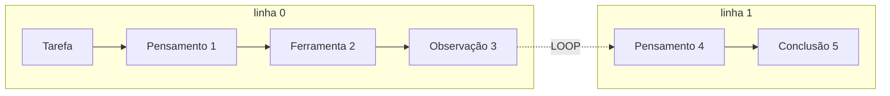

# Schema do fluxograma cognitivo

Contrato JSON devolvido por `GET /agents/{agent_id}/reasoning-flow` e
`GET /reasoning/sessions/{id}/flow`, produzido por `services/reasoning_flow.py`.

O formato é diretamente consumível por D3.js e React Flow: o backend já entrega a
topologia **e** as dicas de posicionamento, para que o cliente não precise recalcular o
layout do ciclo ReAct a cada atualização.

---

## 1. Envelope

```json
{
  "nodes": [ ... ],
  "edges": [ ... ],
  "meta":  { ... }
}
```

---

## 2. Nós (`nodes[]`)

| Campo | Tipo | Descrição |
|---|---|---|
| `id` | string | `"task"` para o nó raiz, `"step-<sequence>"` para os demais |
| `type` | string | `TASK` · `THOUGHT` · `ACTION` · `OBSERVATION` · `CONCLUSION` |
| `label` | string | rótulo pronto para exibição (`"Pensamento 4"`) |
| `content` | string | texto do passo |
| `icon` | string | nome simbólico do ícone |
| `color` | string | cor hex sugerida |
| `column` | int | dica de layout horizontal (ver §4) |
| `row` | int | dica de layout vertical: a iteração do ciclo |
| `payload` | object | contexto da ferramenta (ver `REASONING-FORMAT.md` §5) |
| `meta` | object | `sequence`, `timestamp`, `duration_ms`, `tokens`, `model` |

### Estilo por tipo

| `type` | `label` base | `icon` | `color` | `column` |
|---|---|---|---|---|
| `TASK` | Tarefa | `clipboard` | `#64748b` | 0 |
| `THOUGHT` | Pensamento | `brain` | `#6366f1` | 1 |
| `ACTION` | Ferramenta | `wrench` | `#f59e0b` | 2 |
| `OBSERVATION` | Observação | `eye` | `#0ea5e9` | 3 |
| `CONCLUSION` | Conclusão | `flag` | `#22c55e` | 4 |

O nó `task` tem `meta` próprio: `model`, `complexity` e `started_at`.

---

## 3. Arestas (`edges[]`)

| Campo | Tipo | Descrição |
|---|---|---|
| `id` | string | `"edge-<source>-<target>"` |
| `source` | string | id do nó de origem |
| `target` | string | id do nó de destino |
| `kind` | string | `SEQUENCE` ou `LOOP` |
| `label` | string | rótulo do nó de destino |

As arestas são sempre encadeadas na ordem de execução, portanto
`len(edges) == len(nodes) - 1`.

`kind = "LOOP"` marca exclusivamente a transição `OBSERVATION → THOUGHT`: é a volta do
ciclo ReAct e deve ser desenhada como aresta curva/tracejada para evidenciar a reavaliação.

---

## 4. Dicas de layout

- **`column`** é fixo por tipo de nó: o fluxo avança da esquerda (tarefa) para a direita
  (conclusão).
- **`row`** incrementa a cada novo `THOUGHT` que não seja o primeiro — ou seja, cada linha
  é uma iteração completa do ciclo.
- `meta.rows` informa quantas linhas existem; `meta.columns` traz os rótulos das colunas na
  ordem, prontos para cabeçalho.



---

## 5. Metadados (`meta`)

| Campo | Tipo | Descrição |
|---|---|---|
| `session_id` | string | UUID da sessão |
| `agent_id` | string? | UUID do agente |
| `status` | string | `RUNNING` · `COMPLETED` · `FAILED` · `CANCELLED` |
| `step_count` | int | número de passos no grafo |
| `total_tokens` | int | tokens consumidos na sessão |
| `duration_ms` | int | duração total |
| `conclusion` | string? | resposta final |
| `error` | string? | motivo da falha |
| `columns` | string[] | rótulos das colunas, em ordem |
| `rows` | int | total de iterações do ciclo |

---

## 6. Exemplo

```json
{
  "nodes": [
    {
      "id": "task",
      "type": "TASK",
      "label": "Tarefa",
      "content": "Quanta RAM sobra para novos subagentes?",
      "icon": "clipboard",
      "color": "#64748b",
      "column": 0,
      "row": 0,
      "meta": { "model": "llama3.2:3b", "complexity": "SIMPLE", "started_at": "2026-10-03T20:13:15.747032Z" }
    },
    {
      "id": "step-1",
      "type": "THOUGHT",
      "label": "Pensamento 1",
      "content": "Preciso consultar a infraestrutura antes de responder.",
      "icon": "brain",
      "color": "#6366f1",
      "column": 1,
      "row": 0,
      "payload": { "iteration": 1 },
      "meta": { "sequence": 1, "timestamp": "2026-10-03T20:13:15.811201Z", "duration_ms": 420, "tokens": 38, "model": "llama3.2:3b" }
    },
    {
      "id": "step-2",
      "type": "ACTION",
      "label": "Ferramenta 2",
      "content": "infraestrutura(capacidade atual)",
      "icon": "wrench",
      "color": "#f59e0b",
      "column": 2,
      "row": 0,
      "payload": { "tool": "infraestrutura", "tool_input": "capacidade atual", "iteration": 1 },
      "meta": { "sequence": 2, "timestamp": "2026-10-03T20:13:15.820100Z", "duration_ms": 0, "tokens": 0, "model": "llama3.2:3b" }
    }
  ],
  "edges": [
    { "id": "edge-task-step-1", "source": "task", "target": "step-1", "kind": "SEQUENCE", "label": "Pensamento" },
    { "id": "edge-step-1-step-2", "source": "step-1", "target": "step-2", "kind": "SEQUENCE", "label": "Ferramenta" }
  ],
  "meta": {
    "session_id": "1dfa5270-1188-4fa8-8b83-46b53df8d44a",
    "agent_id": "10f20d1d-c874-4c80-8bd1-739378459c11",
    "status": "RUNNING",
    "step_count": 2,
    "total_tokens": 38,
    "duration_ms": 0,
    "conclusion": null,
    "error": null,
    "columns": ["Tarefa", "Pensamento", "Ferramenta", "Observação", "Conclusão"],
    "rows": 1
  }
}
```

---

## 7. Atualização incremental

Para o painel ao vivo, o cliente não precisa refazer `GET /reasoning-flow` a cada passo:
o evento `step` do WebSocket traz `sequence`, `step_type`, `content`, `payload` e `tokens` —
suficiente para construir o nó localmente aplicando as mesmas regras de `column` e `row`
descritas em §4. Ver `API-REASONING.md` §3.
