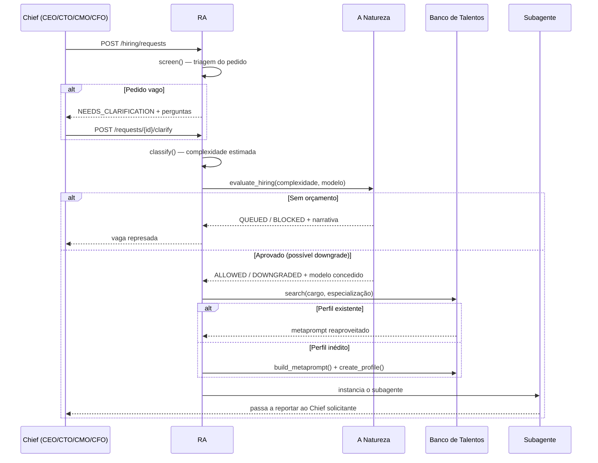
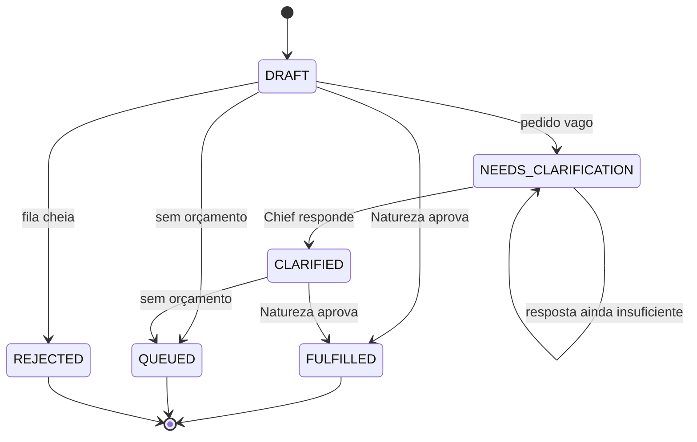

# Fluxo de Contratação de Subagentes

Do pedido de um Chief até a demissão do subagente. O **RA (Recursos Agênticos)** é o único
agente autorizado a instanciar subagentes, e a **Natureza** é a única autorizada a dizer se
há recursos para isso.

Implementação: [`ra_service.py`](../backend/app/services/ra_service.py).

---

## 1. Visão geral



---

## 2. Etapa 1 — Triagem (`screen`)

O RA **recusa-se a abrir a vaga** enquanto o pedido estiver vago. Perguntas disparadas:

| Condição | Pergunta devolvida ao Chief |
|----------|-----------------------------|
| Cargo ausente | "Qual é o cargo exato que você precisa preencher?" |
| Cargo genérico sem especialização (`ajudante`, `assistente`, `analista`, `dev`…) | "Qual a especialização do profissional?" |
| Objetivo com menos de 6 palavras | "Descreva o objetivo em pelo menos uma frase completa" |
| Nenhum entregável | "Quais entregáveis concretos você espera?" |
| Modelo pedido fora do catálogo | "Escolha um do catálogo ou deixe o RA decidir" |

A requisição fica em `NEEDS_CLARIFICATION` e **nenhum recurso de infraestrutura é
consumido**. As respostas chegam por `POST /hiring/requests/{id}/clarify`, que reaplica a
triagem — se ainda estiver vaga, novas perguntas são devolvidas.

---

## 3. Etapa 2 — Classificação e auditoria da Natureza

O texto do pedido (cargo + especialização + objetivo + pedido bruto) passa pelo
classificador de complexidade. Se o Chief informou `complexity` explicitamente, ela
prevalece sobre a estimativa.

A Natureza então decide:

| Decisão | Quando | Status da requisição |
|---------|--------|----------------------|
| `ALLOWED` | Orçamento comporta o modelo preferencial | `FULFILLED` |
| `DOWNGRADED` | Só cabe um modelo de tier menor, ou infraestrutura crítica | `FULFILLED` |
| `QUEUED` | Nem o modelo mais leve cabe, ou quadro lotado | `QUEUED` |
| `BLOCKED` | A fila de espera também está cheia | `REJECTED` |

Quando um modelo específico é pedido, ele vira **teto**, não decisão final: a Natureza
ainda pode rebaixá-lo. Detalhes em [TALENT-BANK.md §3](TALENT-BANK.md#3-mapeamento-complexidade--modelo).

A auditoria independente está exposta em `POST /nature/audit-request`, e os avisos
estruturados em `GET /nature/alerts`:

| Código | Severidade | Significado |
|--------|-----------|-------------|
| `CAPACITY_WARNING` | `WARNING` | Consumo próximo do teto aprovado |
| `CAPACITY_EXHAUSTED` | `CRITICAL` | Contratações congeladas |
| `HEADCOUNT_FULL` | `CRITICAL` | Todas as estações de trabalho ocupadas |
| `HIRING_QUEUE` | `WARNING` | Há vagas represadas |
| `VRAM_EXHAUSTED` | `CRITICAL` | Aceleração por GPU indisponível |

---

## 4. Etapa 3 — Perfil e instanciação

1. O RA busca no Banco de Talentos. Encontrando um perfil aderente, reaproveita o
   metaprompt (`TALENT_PROFILE_REUSED`) — economia de tokens e tempo.
2. Caso contrário, redige um metaprompt novo e o arquiva (`TALENT_PROFILE_CREATED`).
3. O subagente é criado com o modelo concedido pela Natureza, `reports_to_id` apontando
   para o Chief solicitante e `attributes` guardando o rastro (`request_id`,
   `talent_slug`, `talent_version`, `nature_decision`).
4. `register_usage()` incrementa o contador do perfil e grava a execução no histórico.

---

## 5. Etapa 4 — Demissão

`POST /agents/subagents/{id}/dismiss` encerra o contrato:

- O **relatório final** (se enviado) é arquivado em `corporate_memory` como `REPORT` — é o
  único artefato que sobrevive.
- A **nota de desempenho** (1–5, opcional) é creditada ao perfil do Banco de Talentos.
- `status = TERMINATED`, `estimated_ram_mb = 0` e `system_prompt = ""`: a memória de
  trabalho é liberada e a Natureza volta a contabilizar a estação como livre.
- O metaprompt **permanece** no Banco de Talentos para recontratações.

Chiefs não podem ser demitidos (HTTP 422).

---

## 6. Ciclo de vida da requisição



---

## 7. Endpoints

| Método | Rota | O que faz |
|--------|------|-----------|
| `POST` | `/hiring/requests` | Abre a vaga junto ao RA |
| `POST` | `/hiring/requests/{id}/clarify` | Responde aos questionamentos do RA |
| `GET` | `/hiring/requests` | Lista requisições (filtro `request_status`) |
| `GET` | `/hiring/requests/{id}` | Detalhe de uma requisição |
| `POST` | `/agents/subagents/{id}/dismiss` | Demite o subagente |
| `POST` | `/nature/audit-request` | Auditoria isolada da Natureza |
| `GET` | `/nature/alerts` | Alertas corporativos estruturados |

---

## 8. Trilha de auditoria

Um ciclo completo deixa este rastro em `audit_logs`:

```text
SUBAGENT_REQUESTED        → o Chief abriu a vaga
SUBAGENT_CLARIFICATION    → o RA devolveu perguntas (quando aplicável)
NATURE_DECISION           → veredito + snapshot de recursos + classificação
TALENT_PROFILE_CREATED    → metaprompt inédito arquivado
  ou TALENT_PROFILE_REUSED → perfil resgatado do Banco de Talentos
AGENT_CREATED             → subagente admitido
TALENT_PROFILE_RATED      → nota de desempenho na demissão
AGENT_TERMINATED          → contrato encerrado, RAM liberada
```
