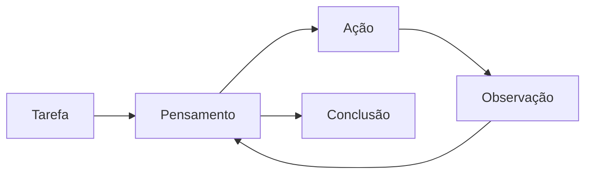

# Formato ReAct — contrato do raciocínio capturado

Este documento define o formato que os agentes da TheyWork usam para pensar em voz alta e
como cada fragmento desse raciocínio é persistido. Ele é a fonte de verdade para
`services/react_engine.py`, `services/reasoning_tracer.py` e o painel de raio-X cognitivo.

---

## 1. O ciclo

Todo agente que executa uma tarefa percorre o ciclo **ReAct** (*Reasoning and Acting*):



A volta `Observação → Pensamento` é o que diferencia ReAct de um simples prompt: o agente
reavalia o que sabe depois de cada ferramenta, em vez de responder de uma vez.

---

## 2. Formato exigido do modelo

O prompt de sistema (`REACT_INSTRUCTIONS`) impõe este formato:

```text
Pensamento: <o que você sabe e o que falta descobrir>
Ação: <nome exato de uma ferramenta da lista>
Entrada da Ação: <o argumento da ferramenta>
```

Quando o agente tem informação suficiente:

```text
Pensamento: <síntese final>
Conclusão: <resposta objetiva para a tarefa>
```

A `Observação` **nunca** é escrita pelo modelo: ela é injetada pelo sistema com o resultado
real da ferramenta. Isso impede o agente de alucinar evidências.

### Tolerância do parser

`react_engine.parse_turn` aceita variações comuns dos modelos locais:

| Rótulo aceito | Mapeado para |
|---|---|
| `Pensamento`, `Raciocinio`, `Raciocínio` | pensamento |
| `Ação`, `Acao`, `Ferramenta` | ferramenta |
| `Entrada da Ação`, `Entrada` | argumento da ferramenta |
| `Conclusão`, `Conclusao`, `Resposta Final` | conclusão |

Também são tolerados: acentuação ausente, caixa alta/baixa, `**negrito**` em volta do rótulo
e conteúdo em múltiplas linhas (as linhas seguintes pertencem ao último rótulo visto).

Se o modelo ignorar o formato por completo, a resposta crua vira simultaneamente o
pensamento e a conclusão — a execução nunca trava por desvio de formato.

---

## 3. Tipos de passo

| `step_type` | Significado | Origem |
|---|---|---|
| `THOUGHT` | Raciocínio bruto do modelo | tokens gerados pelo LLM |
| `ACTION` | Invocação de ferramenta | rótulos `Ação` + `Entrada da Ação` |
| `OBSERVATION` | Resultado devolvido pela ferramenta | execução real, nunca o modelo |
| `CONCLUSION` | Resposta final da tarefa | rótulo `Conclusão` |

Cada passo é imutável depois de gravado e recebe um `sequence` monotônico dentro da sessão.

---

## 4. Esquema persistido

### `reasoning_sessions`

| Campo | Tipo | Descrição |
|---|---|---|
| `id` | UUID | identificador da execução |
| `agent_id` | UUID? | agente que raciocinou |
| `thread_id` | UUID? | correlação com uma deliberação do conselho |
| `task` | text | enunciado recebido |
| `status` | enum | `RUNNING` · `COMPLETED` · `FAILED` · `CANCELLED` |
| `complexity` | enum | `TRIVIAL`…`CRITICAL` (define o modelo preferido) |
| `model_name` | varchar | modelo Ollama efetivamente usado |
| `step_count` | int | total de passos |
| `prompt_tokens` / `completion_tokens` / `total_tokens` | int | contabilidade do Ollama |
| `duration_ms` | int | tempo de parede da execução |
| `estimated_ram_mb` | int | RAM reservada ao agente (base do custo) |
| `conclusion` / `error` | text? | desfecho |
| `started_at` / `finished_at` | timestamptz | janela de execução |

### `reasoning_steps`

| Campo | Tipo | Descrição |
|---|---|---|
| `id` | bigint | sequencial global |
| `session_id` | UUID | FK para a sessão (`ON DELETE CASCADE`) |
| `sequence` | int | ordem dentro da sessão, começa em 1 |
| `step_type` | enum | tipo do nó ReAct |
| `content` | text | texto legível do passo |
| `model_name` | varchar? | modelo que produziu o passo |
| `tokens` | int | tokens de saída atribuídos ao passo |
| `duration_ms` | int | duração do passo |
| `payload` | jsonb | contexto estruturado (ver §5) |

> **Decisão (ADR-005):** uma única tabela com discriminador, em vez de quatro tabelas
> (`reasoning_logs`, `action_logs`, `observation_logs`, `conclusion_logs`). As colunas seriam
> idênticas e o replay ordenado exigiria quatro JOINs.

---

## 5. Contexto de ferramentas no `payload`

O `payload` é o que alimenta o raio-X: ele guarda exatamente o que o agente pesquisou e o
que recebeu de volta.

| Tipo de passo | Chaves do `payload` |
|---|---|
| `THOUGHT` | `iteration`, `raw` (resposta integral do modelo) |
| `ACTION` | `tool`, `tool_input`, `iteration` |
| `OBSERVATION` | `tool`, `error?` + chaves específicas da ferramenta |
| `CONCLUSION` | `iteration`, `reason?`, `truncated?`, `max_steps?` |

### Payload por ferramenta (`OBSERVATION`)

| Ferramenta | Chaves |
|---|---|
| `memoria_corporativa` | `search_terms` (termos normalizados), `results[]` (`id`, `title`, `type`), `total_scanned` |
| `banco_de_talentos` | `query`, `matched`, `profile_id`, `slug`, `version`, `score`, `matched_on` |
| `auditoria` | `query`, `results[]` (`event_type`, `actor`, `summary`) |
| `infraestrutura` | `query`, `snapshot` (RAM/VRAM/CPU completos da Natureza) |
| `calculadora` | `expression`, `result` |

As ferramentas são **integralmente offline**: nenhuma delas faz rede. `calculadora` avalia a
expressão por AST (`ast.parse` + walk explícito), nunca por `eval`.

---

## 6. Encerramento

| Situação | `status` | Observação |
|---|---|---|
| Modelo emitiu `Conclusão` | `COMPLETED` | caminho normal |
| Modelo pensou sem pedir ferramenta | `COMPLETED` | `payload.reason = "sem_acao"` |
| Teto de `reasoning_max_steps` atingido | `COMPLETED` | `payload.truncated = true` |
| Exceção durante o loop | `FAILED` | `error` preenchido, agente vai para `BLOCKED` |
| Interrupção externa | `CANCELLED` | via `tracer.cancel()` |

Início e fim sempre deixam rastro em `audit_logs` (`REASONING_STARTED`,
`REASONING_COMPLETED`, `REASONING_FAILED`).

---

## 7. Modo offline (sem Ollama)

Quando o servidor Ollama está fora do ar ou o modelo exigido não foi baixado, o motor cai
num **planejador determinístico**: ele escolhe uma ferramenta por heurística lexical, executa
a consulta de verdade e conclui com base na observação obtida. A sessão continua sendo
capturada e transmitida normalmente — a diferença aparece apenas em `total_tokens = 0`.

| Termos na tarefa | Ferramenta escolhida |
|---|---|
| ram, vram, cpu, infraestrutura, hardware, capacidade | `infraestrutura` |
| contratar, vaga, cargo, perfil, talento, subagente | `banco_de_talentos` |
| auditoria, evento, historico, trilha, decisao | `auditoria` |
| *(padrão)* | `memoria_corporativa` |

---

## 8. Configuração

| Variável | Padrão | Efeito |
|---|---|---|
| `REASONING_CAPTURE_ENABLED` | `true` | `false` mantém a sessão, mas não persiste os passos |
| `REASONING_MAX_STEPS` | `8` | teto de iterações do loop ReAct |
| `REASONING_STREAM_BUFFER` | `256` | eventos enfileirados por assinante WebSocket |
| `REASONING_RETENTION_DAYS` | `30` | corte padrão da política de retenção |
| `REASONING_MAX_CONTENT_CHARS` | `8000` | truncamento do conteúdo de cada passo |
