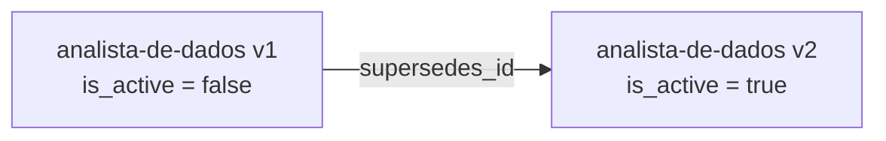
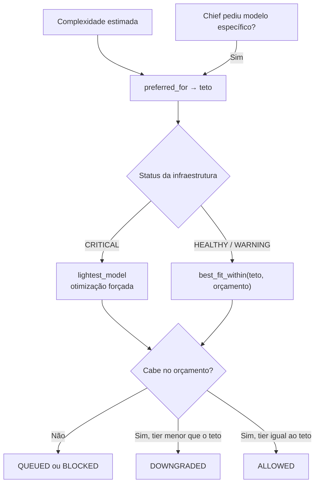

# Banco de Talentos e Seleção de Modelos

Dois mecanismos que economizam recursos da empresa virtual: o **Banco de Talentos**, que
evita redigir metaprompts repetidos, e a **seleção dinâmica de modelos**, que aloca o menor
modelo capaz de dar conta da tarefa.

Implementação: [`talent_bank.py`](../backend/app/services/talent_bank.py) ·
[`complexity_classifier.py`](../backend/app/services/complexity_classifier.py) ·
[`model_catalog.py`](../backend/app/services/model_catalog.py) ·
[`prompt_factory.py`](../backend/app/services/prompt_factory.py).

---

## 1. Banco de Talentos (`talent_bank`)

Cada linha é um **metaprompt arquivado**. Quando um Chief pede um perfil recorrente, o RA
resgata o prompt existente em vez de gerar um novo.

### Identidade e busca

- `slug` — identificador derivado do cargo (`"Analista de Dados Sênior"` →
  `analista-de-dados-senior`), sem acentos e sem caracteres especiais.
- `keywords.terms` — termos normalizados do cargo + especialização, descartando stopwords
  em português e tokens com menos de 3 caracteres.

A busca (`talent_bank.search`) tem dois estágios:

1. **Slug exato** → `score = 1.0`, `matched_on = "slug"`.
2. **Similaridade de Jaccard** sobre as palavras-chave, aceitando o melhor candidato com
   `score >= MIN_MATCH_SCORE` (0.5) → `matched_on = "keywords"`.

Apenas versões **ativas** participam da busca.

### Versionamento

Recriar um perfil com o mesmo slug **não sobrescreve**: gera a versão seguinte.



- A versão anterior é marcada `is_active = false` e permanece no histórico.
- A unicidade é `(slug, version)`.
- **Métricas não são herdadas:** cada versão é avaliada pelo próprio desempenho, pois o
  prompt mudou.

### Desempenho e histórico

| Campo | Papel |
|-------|-------|
| `usage_count` / `last_used_at` | Quantas vezes o perfil foi contratado |
| `rating_sum` / `rating_count` | Notas de 1 a 5 dadas pelos Chiefs na demissão |
| `average_rating` | Propriedade derivada; `None` enquanto não houver avaliação |
| `task_history.entries` | Últimas 20 execuções e feedbacks (lista circular) |

### Endpoints

| Método | Rota | O que faz |
|--------|------|-----------|
| `GET` | `/talent/profiles` | Perfis ativos, dos mais usados para os menos usados |
| `GET` | `/talent/profiles/search` | Mesma busca que o RA executa |
| `GET` | `/talent/profiles/{slug}/versions` | Histórico completo de versões |
| `POST` | `/talent/profiles/{id}/rating` | Registra nota de desempenho (1–5) |

---

## 2. Classificação de complexidade

`complexity_classifier.classify()` converte a descrição da vaga em um `TaskComplexity`,
somando pesos de sinais textuais:

| Faixa de sinais | Peso | Exemplos |
|-----------------|-----:|----------|
| Trivial / simples | −2 a −1 | `resumir`, `ata`, `transcrever`, `traduzir` |
| Moderado | +1 | `analisar`, `relatorio`, `pesquisa`, `persona` |
| Complexo | +2 a +3 | `arquitetura`, `implementar`, `codigo`, `seguranca` |
| Crítico | +4 a +5 | `estrategia`, `impasse`, `crise`, `sobrevivencia` |

Ajustes de escopo: `+1` para 3 ou mais entregáveis, `+1` para 3 ou mais ferramentas, `+1`
para briefings com 60 ou mais palavras, `−1` para briefings de até 5 palavras.

Bandas de score → nível:

| Score | Nível |
|-------|-------|
| ≤ −1 | `TRIVIAL` |
| ≤ 1 | `SIMPLE` |
| ≤ 4 | `MODERATE` |
| ≤ 8 | `COMPLEX` |
| > 8 | `CRITICAL` |

**Piso por cargo:** o resultado nunca fica abaixo do piso do Chief solicitante
(CEO/CTO = `MODERATE`, CMO/CFO = `SIMPLE`, RA = `TRIVIAL`). O piso só eleva, nunca rebaixa.

---

## 3. Mapeamento complexidade → modelo

| Complexidade | Modelo preferencial | RAM | Tier |
|--------------|---------------------|----:|-----:|
| `TRIVIAL` / `SIMPLE` | `llama3.2:3b` | 2048 MB | 1 |
| `MODERATE` | `phi4-mini:3.8b` | 2355 MB | 2 |
| — | `gemma3n:e4b` | 3072 MB | 3 |
| `COMPLEX` | `qwen3:8b` | 4710 MB | 4 |
| `CRITICAL` | `deepseek-r1:8b` | 5120 MB | 5 |

### Fallback e teto

O modelo preferencial é apenas o **teto**; a Natureza dá a palavra final:



`best_fit_within` escolhe o modelo de **maior tier que ainda cabe** no orçamento de RAM
alocável, sem ultrapassar o teto. Quando `granted.tier < preferred.tier`, a decisão é
registrada como `DOWNGRADED` com narrativa corporativa de contenção de custos.

---

## 4. Anatomia do metaprompt

`prompt_factory.build_metaprompt()` monta sempre as mesmas seções:

```text
# Cargo: <job_title>
<vínculo com o Chief solicitante>

## Objetivo
## Especialização        (quando informada)
## Entregáveis
## Ferramentas disponíveis
## Limitações e restrições
## Formato de saída esperado
```

As **restrições base** valem para todo subagente: escopo limitado à vaga, proibição de
instanciar outros agentes, proibição de acesso externo, obrigação de perguntar ao gestor
em vez de supor e obrigação de entregar um relatório final — o único artefato que
sobrevive à demissão.

O **formato de saída** varia conforme a complexidade: de "responda em até 5 linhas"
(`TRIVIAL`) a "explicite o raciocínio passo a passo e finalize com um bloco DECISÃO"
(`CRITICAL`).
