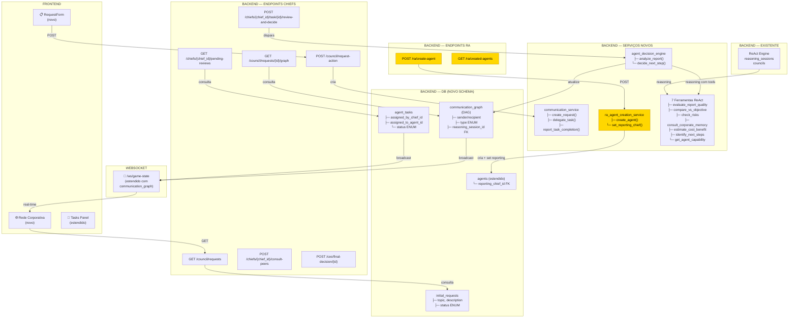
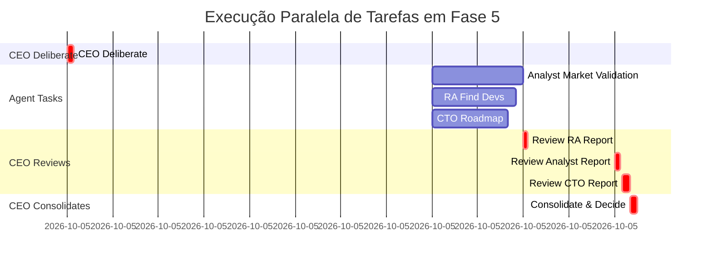

# Arquitetura Fase 5 — Rede Corporativa (Diagrama Visual)

## Arquitetura Geral



---

## Camadas de Implementação

```
┌───────────────────────────────────────────┐
│           FRONTEND (React/TS)             │
│  ┌──────────────────────────────────────┐ │
│  │ RequestForm (novo)                   │ │
│  │ Rede Corporativa (novo, D3.js)      │ │
│  │ Tasks Panel (estendido)              │ │
│  └──────────────────────────────────────┘ │
├───────────────────────────────────────────┤
│      WEBSOCKET LAYER (Real-time)          │
│  /ws/game-state (estendido)              │
├───────────────────────────────────────────┤
│        REST API (FastAPI, novo)           │
│  ┌──────────────────────────────────────┐ │
│  │ /council/request-action              │ │
│  │ /council/requests/{id}/graph         │ │
│  │ /chiefs/{chief_id}/pending-reviews   │ │
│  │ /chiefs/{chief_id}/task/{id}/review  │ │
│  │ /chiefs/{chief_id}/consult-peers     │ │
│  │ /ra/create-agent (NOVO)              │ │
│  │ /ra/created-agents                   │ │
│  │ /ceo/final-decision/{id}             │ │
│  └──────────────────────────────────────┘ │
├───────────────────────────────────────────┤
│       BUSINESS LOGIC (Python Services)    │
│  ┌──────────────────────────────────────┐ │
│  │ communication_service                │ │
│  │ agent_decision_engine                │ │
│  │ ra_agent_creation_service (NOVO)     │ │
│  │ council_service (estendido)          │ │
│  └──────────────────────────────────────┘ │
├───────────────────────────────────────────┤
│   REASONING (ReAct + 7 Ferramentas)      │
│  ┌──────────────────────────────────────┐ │
│  │ react_engine (existente)             │ │
│  │ + evaluate_report_quality            │ │
│  │ + compare_vs_objective               │ │
│  │ + check_risks                        │ │
│  │ + [4 mais]                           │ │
│  └──────────────────────────────────────┘ │
├───────────────────────────────────────────┤
│    DATA LAYER (SQLAlchemy + Alembic)      │
│  ┌──────────────────────────────────────┐ │
│  │ communication_graph (novo)           │ │
│  │ initial_requests (novo)              │ │
│  │ agent_tasks (novo)                   │ │
│  │ agents.reporting_chief_id (novo)     │ │
│  │ [existentes: agents, sessions, ...]  │ │
│  └──────────────────────────────────────┘ │
└───────────────────────────────────────────┘
```

**Mudanças-chave:**
- RA é serviço de criação de agentes (não supervisor)
- Cada agente tem `reporting_chief_id` (seu supervisor)
- Reports vão direto para o chief, não para CEO
- RA cria agentes sob demanda dos chiefs

---

## Paralelismo (Parte Crítica)



**Observação:** Tasks em paralelo → Reports em paralelo → Reviews em paralelo → Decisão consolidada

---

## Comparativo: Antes vs. Depois

| Aspecto | Fase 4 | Fase 5 |
|---------|--------|--------|
| **Workflow** | Linear | DAG dinâmico |
| **Feedback** | Nenhum | Loop contínuo |
| **Comunicação** | CEO solo | CEO + Chiefs + Agents |
| **Decisões** | Determinísticas | ReAct + 7 ferramentas |
| **Observabilidade** | Agente individual | Rede corporativa inteira |
| **Interface** | Agente selecionado | Grafo + pedidos + tarefas |
| **Paralelismo** | Não | Sim, múltiplos agents |
| **Escalabilidade** | ~10 agents | ~50+ agents (via grafo) |
