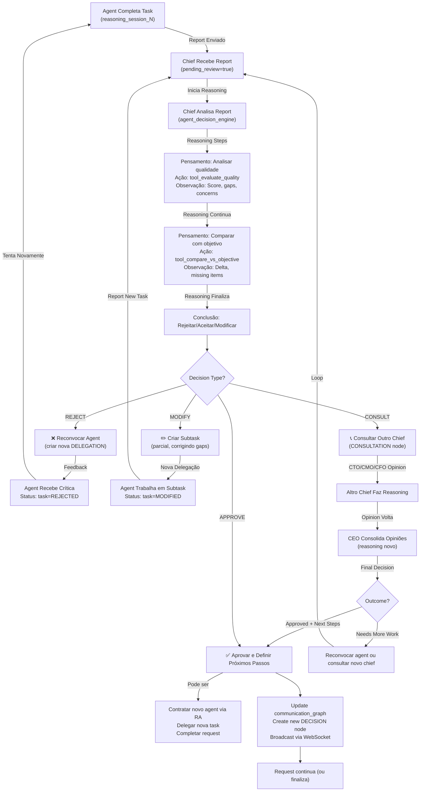

# Fluxo de Decisão do Chief — Análise de Reports

Diagrama do ciclo de feedback quando um chief recebe um report de um agente.

---

## Parametrização de Decisões

Como o chief **supervisor especializado** decide qual ação tomar? Depende de:

| Fator | REJECT | MODIFY | CONSULT_PEERS | ESCALATE | APPROVE |
|-------|--------|--------|---------------|----------|---------|
| **Qualidade** | <70% | 70-85% | 85-95% | 85-95% | >90% |
| **Completude** | <50% | 50-80% | 80-95% | 75-95% | 100% |
| **Riscos** | Alto | Médio | Baixo | Médio | Nenhum |
| **Urgência** | Med/High | Medium | Low | Medium | Low |
| **Complexidade** | Qualquer | Alta | Alta | Muito Alta | Qualquer |
| **Afeta Múltiplas Áreas** | Não | Não | Sim | Sim | Não |

**Nota:** Quando afeta múltiplas áreas → CONSULT_PEERS. Quando há disagreement → ESCALATE para CEO.

---

## Modo AUTOMÁTICO vs MANUAL

**AUTOMÁTICO** (default):
- Chief recebe report → reasoning automático → decisão automática
- User vê tudo acontecendo em tempo real no frontend
- Mais realista, mais dinâmico

**MANUAL**:
- Chief recebe report → reasoning automático → **user valida decisão**
- User clica "Confirmar: REJECT, pedir refazer"
- Mais controle, mais lento, ideal para debug/teaching
