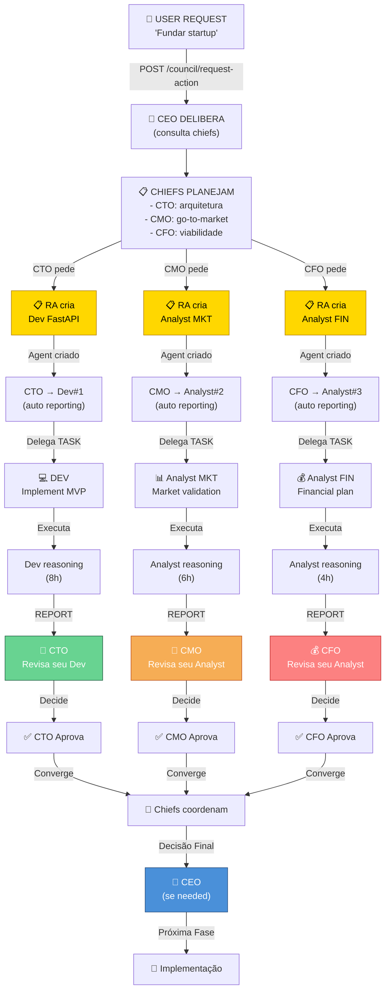

# Exemplo Prático: Grafo de Comunicações — Fundar Startup

Demonstração de como o grafo evolui com o tempo quando o usuário submete o pedido:
**"Fundem uma startup de tecnologia para escritórios de contabilidade"**

Veja [../../.github/memories/exec-plans/backlog/GRAFO-EXEMPLO.md](../../.github/memories/exec-plans/backlog/GRAFO-EXEMPLO.md) para o exemplo completo com 14 estados detalhados.

## Resumo dos Estados

- **Estado 1 (T=0ms):** Pedido submetido (1 nó USER → CEO)
- **Estado 2 (T=2s):** CEO delibera (consulta CTO, CMO, CFO)
- **Estado 3 (T=5s):** Chiefs opinam (3 reasoning_sessions)
- **Estado 4 (T=8s):** CEO consolida e delega (3 tasks criadas)
- **Estado 5 (T=10s):** Agents reconhecem tarefas
- **Estado 6 (T=15s–60s):** Agents executam (reasoning paralelo)
- **Estado 7 (T=75s):** RA reporta (3 candidatos encontrados)
- **Estado 8 (T=80s):** CEO revisa report do RA
- **Estado 9 (T=90s):** CEO aprova e delega contratação
- **Estado 10 (T=120s):** Analyst reporta (validação concluída)
- **Estado 11 (T=130s):** CEO revisa Analyst e consulta CTO
- **Estado 12 (T=145s):** CTO propõe roadmap
- **Estado 13 (T=160s):** CEO abre nova demanda com RA
- **Estado 14 (T=200s):** Grafo complexo e interconectado

---

## Fluxo Agregado: Do Pedido Inicial até Conclusão



**Diferenças-Chave vs. Linear:**
- ✅ RA cria agentes sob demanda (especialista em prompts)
- ✅ Agentes criados reportam automaticamente para o chief que pediu
- ✅ Cada chief supervisiona apenas seus agentes
- ✅ Reports chegam direto ao chief, não escalão para CEO
- ✅ Chiefs revisam em paralelo
- ✅ CEO apenas decide se há disagreement

---

## Paralelismo Real

Diferente do loop sequencial tradicional:

```
❌ Sequencial (ruins):
Task 1 → Report 1 → Review 1 (bloqueado esperando) → Task 2 → Report 2 → ...

✅ Paralelo (Fase 5):
Task 1 ─┐
Task 2 ─┼─→ Reports 1,2,3 chegando em paralelo
Task 3 ─┤     (CEO recebe conforme pronto, analisa cada um)
        └─→ Chief 1 reconvoca Task 1 (REJECT)
        └─→ Chief 2 aprova Task 2
        └─→ Chief 3 consulta colegas Task 3
        
        Resultado: DAG complexo, não pipeline linear
```
